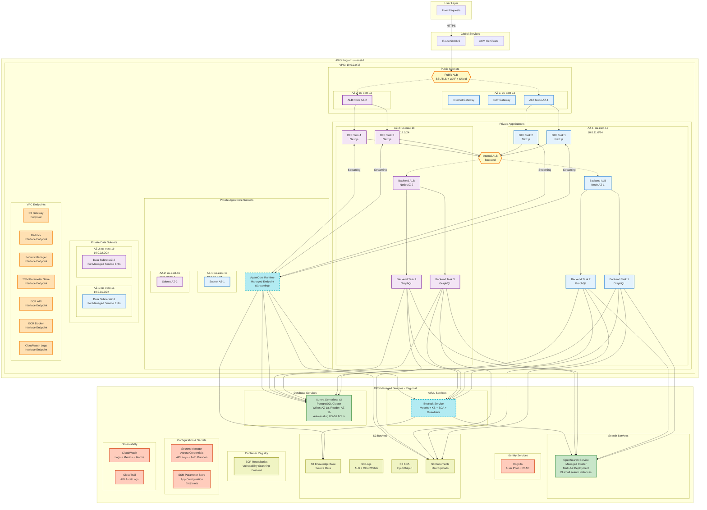

# AWS Cloud Architecture Design Document

## Overview

This document presents a production-grade, secure, and cost-effective AWS cloud architecture for BidOps.ai, designed specifically for a hackathon environment while maintaining enterprise-level security and reliability. The architecture follows AWS Well-Architected Framework principles, including the Generative AI Lens, and implements a multi-service system with Next.js frontend, GraphQL backend, and AgentCore-based AI agents.

### Architecture Principles

- **Security First**: Defense in depth with multiple layers of security controls
- **Cost Optimization**: Right-sized resources with auto-scaling for hackathon budget constraints
- **High Availability**: Multi-AZ deployment with fault tolerance
- **Scalability**: Auto-scaling capabilities across all tiers
- **Observability**: Comprehensive monitoring and logging
- **Automation**: Infrastructure as Code with CI/CD pipelines

## Architecture

### Enterprise-Grade Architecture Diagram (POC Optimized)



### Network Architecture

#### VPC Design
- **CIDR Block**: 10.0.0.0/16 (65,536 IP addresses)
- **Multi-AZ Deployment**: Across 3 Availability Zones for high availability
- **Subnet Strategy**:
  - Public Subnets: 10.0.1.0/24, 10.0.2.0/24, 10.0.3.0/24 (ALB, NAT Gateways)
  - Private App Subnets: 10.0.11.0/24, 10.0.12.0/24, 10.0.13.0/24 (ECS Services)
  - Private Data Subnets: 10.0.21.0/24, 10.0.22.0/24, 10.0.23.0/24 (Aurora, OpenSearch)

#### Security Groups Configuration

**Frontend Security Group**:
- Inbound: Port 3000 from ALB Security Group
- Outbound: HTTPS (443) to internet, Aurora port to DB Security Group

**Backend Security Group**:
- Inbound: Port 4000 from ALB Security Group
- Outbound: HTTPS (443) to internet, Aurora port to DB Security Group

**Database Security Group**:
- Inbound: PostgreSQL port (5432) from Frontend and Backend Security Groups
- Outbound: None

**ALB Security Group**:
- Inbound: HTTP (80), HTTPS (443) from internet
- Outbound: To Frontend and Backend Security Groups

## Components and Interfaces

### 1. Frontend Application (Next.js)

#### Container Configuration
```dockerfile
FROM node:18-alpine AS base
WORKDIR /app
COPY package*.json ./
RUN npm ci --only=production

FROM base AS build
COPY . .
RUN npm run build

FROM node:18-alpine AS runtime
WORKDIR /app
COPY --from=build /app/.next ./.next
COPY --from=build /app/public ./public
COPY --from=build /app/package*.json ./
COPY --from=build /app/node_modules ./node_modules
EXPOSE 3000
CMD ["npm", "start"]
```

#### ECS Service Configuration
- **Task Definition**: 
  - CPU: 512 units (0.5 vCPU)
  - Memory: 1024 MB (1 GB)
  - Network Mode: awsvpc
- **Service Configuration**:
  - Desired Count: 2 (minimum for HA)
  - Auto Scaling: 2-10 tasks based on CPU/Memory utilization
  - Health Check: HTTP GET /api/health
  - Deployment: Rolling update with 50% replacement

#### Environment Variables
```bash
NEXT_PUBLIC_API_URL=https://api.bidops.ai/graphql
NEXT_PUBLIC_COGNITO_USER_POOL_ID=${COGNITO_USER_POOL_ID}
NEXT_PUBLIC_COGNITO_CLIENT_ID=${COGNITO_CLIENT_ID}
NEXT_PUBLIC_REGION=${AWS_REGION}
AGENTCORE_ENDPOINT=${AGENTCORE_ENDPOINT}
```

### 2. Backend GraphQL API

#### Container Configuration
```dockerfile
FROM node:18-alpine AS base
WORKDIR /app
COPY package*.json ./
RUN npm ci --only=production

FROM base AS build
COPY . .
RUN npm run build

FROM node:18-alpine AS runtime
WORKDIR /app
COPY --from=build /app/dist ./dist
COPY --from=build /app/package*.json ./
COPY --from=build /app/node_modules ./node_modules
EXPOSE 4000
CMD ["node", "dist/server.js"]
```

#### ECS Service Configuration
- **Task Definition**:
  - CPU: 1024 units (1 vCPU)
  - Memory: 2048 MB (2 GB)
  - Network Mode: awsvpc
- **Service Configuration**:
  - Desired Count: 2 (minimum for HA)
  - Auto Scaling: 2-20 tasks based on CPU/Memory utilization
  - Health Check: HTTP GET /health
  - Deployment: Rolling update with 50% replacement

#### Database Connection (MCP Compatible)
```typescript
// Aurora PostgreSQL connection configuration for MCP compatibility
const dbConfig = {
  host: process.env.AURORA_ENDPOINT,
  port: 5432,
  database: process.env.DB_NAME,
  username: process.env.DB_USERNAME, // From Secrets Manager
  password: process.env.DB_PASSWORD, // From Secrets Manager
  ssl: { 
    rejectUnauthorized: false,
    ca: process.env.RDS_CA_CERT // Aurora SSL certificate
  },
  pool: {
    min: 2,
    max: 20, // Aurora handles connection pooling efficiently
    acquireTimeoutMillis: 30000,
    idleTimeoutMillis: 30000,
    createTimeoutMillis: 30000
  },
  // MCP-specific configuration
  mcp_compatible: true,
  connection_retry: {
    max_retries: 3,
    retry_delay: 1000
  }
}
```

### 3. AgentCore AI Agent

#### Deployment Architecture
- **Runtime**: AWS Bedrock AgentCore Runtime
- **Packaging**: Single bundle with all dependencies
- **Container**: ECR for version management and deployment
- **Integration**: Native AgentCore Memory and Observability

#### Agent Configuration with MCP Integration
```python
# AgentCore configuration with MCP support
agent_config = {
    "runtime": "bedrock-agentcore",
    "memory": {
        "type": "managed",
        "retention_days": 30,
        "session_management": True
    },
    "observability": {
        "tracing": True,
        "metrics": True,
        "logs": True,
        "cloudwatch_integration": True
    },
    "security": {
        "authentication": "iam",
        "authorization": "rbac",
        "encryption_at_rest": True,
        "encryption_in_transit": True
    },
    "mcp_integration": {
        "enabled": True,
        "protocol_version": "2024-11-05",
        "transport": "stdio"
    }
}
```

#### MCP Tools Configuration
```python
# MCP Tools configuration for AgentCore
mcp_tools_config = {
    "postgresql_mcp": {
        "server_command": ["uvx", "mcp-server-postgres"],
        "connection_string": "postgresql://{username}:{password}@{host}:{port}/{database}",
        "ssl_mode": "require",
        "pool_size": 10,
        "timeout": 30
    },
    "s3_mcp": {
        "server_command": ["uvx", "mcp-server-s3"],
        "buckets": [
            "bidops-documents",
            "bidops-artifacts", 
            "bidops-knowledge-base"
        ],
        "region": "us-east-1",
        "permissions": ["read", "write", "list"]
    },
    "bedrock_mcp": {
        "server_command": ["uvx", "mcp-server-bedrock"],
        "models": ["claude-3-haiku", "claude-3-sonnet", "nova-micro", "nova-lite"],
        "knowledge_bases": True,
        "data_automation": True,
        "guardrails": True,
        "region": "us-east-1"
    }
}

# Database access through MCP PostgreSQL tool
database_mcp_config = {
    "type": "mcp-postgresql",
    "endpoint": os.environ["AURORA_ENDPOINT"],
    "credentials_source": "secrets-manager",
    "ssl_required": True,
    "connection_pooling": "aurora-native",
    "mcp_server": "postgresql_mcp"
}

# S3 access through MCP S3 tool
s3_mcp_config = {
    "type": "mcp-s3",
    "buckets": {
        "documents": "bidops-documents",
        "artifacts": "bidops-artifacts",
        "knowledge_base": "bidops-knowledge-base"
    },
    "permissions": ["read", "write", "list"],
    "mcp_server": "s3_mcp"
}

# Bedrock services access through MCP Bedrock tool
bedrock_mcp_config = {
    "type": "mcp-bedrock",
    "knowledge_bases": True,
    "models": ["claude-3-haiku", "claude-3-sonnet", "nova-micro", "nova-lite"],
    "data_automation": True,
    "guardrails": True,
    "evaluations": True,
    "mcp_server": "bedrock_mcp"
}
```

### 4. Database Layer (Aurora Serverless v2 PostgreSQL with MCP Compatibility)

#### Aurora Serverless v2 Configuration
```yaml
Aurora Serverless v2 Cluster:
  Engine: aurora-postgresql
  Version: 15.4 (MCP Compatible)
  Serverless Type: Aurora Serverless v2
  Multi-AZ: true
  
  Capacity Configuration:
    Min ACUs: 0.5 (cost optimization for POC)
    Max ACUs: 16 (sufficient for hackathon workload)
    Auto Pause: Enabled after 5 minutes of inactivity
    Auto Resume: Automatic on connection
  
  Instances:
    - Writer: Aurora Serverless v2 (AZ-1a)
    - Reader: Aurora Serverless v2 (AZ-1b)
  
Storage:
  Type: Aurora Storage (auto-scaling)
  Encryption: AES-256 with KMS
  Initial Size: 20 GB (auto-scales to 128 TB)
  
Backup:
  Retention: 7 days
  Point-in-time Recovery: Enabled
  Cross-region Backup: Disabled (cost optimization)
  
Monitoring:
  Performance Insights: Enabled (7 days retention)
  Enhanced Monitoring: Disabled (cost optimization)
  CloudWatch Integration: Basic metrics
  
Cost Benefits:
  - Pay only for consumed ACUs (not provisioned capacity)
  - Auto-pause during inactivity saves ~90% costs
  - Scales to zero for development environments
  - No need for instance right-sizing
```

#### MCP Integration Strategy
**Why Aurora Serverless v2 for MCP:**
- Aurora Serverless v2 is fully PostgreSQL-compatible with standard connection protocols
- MCP PostgreSQL servers work with any PostgreSQL-compatible database
- Serverless v2 provides automatic scaling and cost optimization for POC
- No connection pooling complexity - Aurora handles it natively
- Perfect for variable workloads typical in hackathon environments

**Connection Management:**
- **Aurora Serverless v2 Pooling**: Built-in connection management with automatic scaling
- **MCP Tool Integration**: Standard PostgreSQL MCP server (`uvx mcp-server-postgres`)
- **Connection Limits**: Auto-scales based on ACU consumption (up to 16 ACUs = ~8,000 connections)
- **SSL/TLS**: Enforced for all connections with certificate validation
- **Credential Management**: AWS Secrets Manager with automatic rotation
- **Failover Handling**: Aurora automatic failover between writer and reader instances
- **Auto-pause/Resume**: Automatic pause during inactivity, resume on first connection

#### MCP PostgreSQL Tool Configuration
```yaml
MCP PostgreSQL Server:
  Command: ["uvx", "mcp-server-postgres"]
  Connection String: "postgresql://{user}:{pass}@{host}:5432/{db}?sslmode=require"
  Pool Configuration:
    min_connections: 2
    max_connections: 20
    connection_timeout: 30s
    idle_timeout: 300s
    max_lifetime: 3600s
  
SSL Configuration:
  mode: require
  ca_file: /opt/aurora-ca-cert.pem
  verify_full: true
  
Error Handling:
  retry_attempts: 3
  retry_delay: 1000ms
  circuit_breaker: enabled
```

### 5. AI/ML Services Integration

#### Bedrock Knowledge Bases
```yaml
Knowledge Base Configuration:
  Vector Store: Amazon OpenSearch Service
  Embedding Model: amazon.titan-embed-text-v1
  Data Sources:
    - S3 Bucket: bidops-knowledge-base
    - Sync Schedule: Daily
  
OpenSearch Configuration:
  Instance Type: t3.small.search (cost-optimized)
  Instance Count: 2 (Multi-AZ)
  Storage: 20 GB EBS gp3
  Encryption: At rest and in transit
```

#### Bedrock Models Access
```yaml
Model Access:
  Claude 3 Haiku: Text generation, analysis
  Claude 3 Sonnet: Complex reasoning, document analysis
  Nova Micro: Cost-effective text processing
  Nova Lite: Lightweight inference tasks
  
Guardrails:
  Content Filtering: Enabled
  PII Detection: Enabled
  Toxicity Detection: Enabled
  Custom Filters: Business-specific rules
```

#### Bedrock Data Automation
```yaml
Data Automation Configuration:
  Input Sources: S3 buckets
  Processing Types:
    - Document parsing (PDF, Word, Excel)
    - Audio transcription
    - Video analysis
  Output Format: Structured JSON
  Integration: Direct API calls from backend
```

## Data Models

### Core Database Schema

```sql
-- Users and Authentication
CREATE TABLE users (
    id UUID PRIMARY KEY DEFAULT gen_random_uuid(),
    cognito_sub VARCHAR(255) UNIQUE NOT NULL,
    email VARCHAR(255) UNIQUE NOT NULL,
    first_name VARCHAR(100) NOT NULL,
    last_name VARCHAR(100) NOT NULL,
    role_id UUID NOT NULL REFERENCES roles(id),
    created_at TIMESTAMP WITH TIME ZONE DEFAULT NOW(),
    updated_at TIMESTAMP WITH TIME ZONE DEFAULT NOW()
);

-- Role-Based Access Control
CREATE TABLE roles (
    id UUID PRIMARY KEY DEFAULT gen_random_uuid(),
    name VARCHAR(50) UNIQUE NOT NULL,
    description TEXT,
    permissions JSONB NOT NULL,
    created_at TIMESTAMP WITH TIME ZONE DEFAULT NOW()
);

-- Projects
CREATE TABLE projects (
    id UUID PRIMARY KEY DEFAULT gen_random_uuid(),
    name VARCHAR(255) NOT NULL,
    description TEXT,
    status VARCHAR(50) NOT NULL DEFAULT 'draft',
    created_by UUID NOT NULL REFERENCES users(id),
    created_at TIMESTAMP WITH TIME ZONE DEFAULT NOW(),
    updated_at TIMESTAMP WITH TIME ZONE DEFAULT NOW()
);

-- Knowledge Bases
CREATE TABLE knowledge_bases (
    id UUID PRIMARY KEY DEFAULT gen_random_uuid(),
    name VARCHAR(255) NOT NULL,
    description TEXT,
    bedrock_kb_id VARCHAR(255) UNIQUE NOT NULL,
    s3_bucket VARCHAR(255) NOT NULL,
    opensearch_index VARCHAR(255) NOT NULL,
    created_at TIMESTAMP WITH TIME ZONE DEFAULT NOW()
);

-- Documents
CREATE TABLE documents (
    id UUID PRIMARY KEY DEFAULT gen_random_uuid(),
    project_id UUID NOT NULL REFERENCES projects(id),
    name VARCHAR(255) NOT NULL,
    file_type VARCHAR(50) NOT NULL,
    s3_key VARCHAR(500) NOT NULL,
    size_bytes BIGINT NOT NULL,
    processing_status VARCHAR(50) DEFAULT 'pending',
    created_at TIMESTAMP WITH TIME ZONE DEFAULT NOW()
);

-- Agent Executions
CREATE TABLE agent_executions (
    id UUID PRIMARY KEY DEFAULT gen_random_uuid(),
    project_id UUID NOT NULL REFERENCES projects(id),
    agent_type VARCHAR(100) NOT NULL,
    status VARCHAR(50) NOT NULL DEFAULT 'running',
    input_data JSONB,
    output_data JSONB,
    agentcore_execution_id VARCHAR(255),
    started_at TIMESTAMP WITH TIME ZONE DEFAULT NOW(),
    completed_at TIMESTAMP WITH TIME ZONE
);
```

### GraphQL Schema Design

```graphql
type User {
  id: ID!
  email: String!
  firstName: String!
  lastName: String!
  role: Role!
  projects: [Project!]!
  createdAt: DateTime!
}

type Role {
  id: ID!
  name: String!
  description: String
  permissions: [Permission!]!
}

type Project {
  id: ID!
  name: String!
  description: String
  status: ProjectStatus!
  documents: [Document!]!
  executions: [AgentExecution!]!
  createdBy: User!
  createdAt: DateTime!
}

type Document {
  id: ID!
  name: String!
  fileType: String!
  sizeBytes: Int!
  processingStatus: ProcessingStatus!
  downloadUrl: String # Presigned S3 URL
  createdAt: DateTime!
}

type AgentExecution {
  id: ID!
  agentType: AgentType!
  status: ExecutionStatus!
  inputData: JSON
  outputData: JSON
  startedAt: DateTime!
  completedAt: DateTime
}

enum ProjectStatus {
  DRAFT
  IN_PROGRESS
  UNDER_REVIEW
  COMPLETED
  CANCELLED
}

enum AgentType {
  SUPERVISOR
  PARSER
  ANALYSIS
  CONTENT
  COMPLIANCE
  QA
  COMMS
  SUBMISSION
}
```

## Error Handling

### Application-Level Error Handling

#### Frontend Error Boundaries
```typescript
// Global error boundary for React components
export class GlobalErrorBoundary extends Component<Props, State> {
  componentDidCatch(error: Error, errorInfo: ErrorInfo) {
    // Log to CloudWatch
    logger.error('Frontend Error', {
      error: error.message,
      stack: error.stack,
      componentStack: errorInfo.componentStack,
      userId: this.props.user?.id
    });
    
    // Send to error tracking service
    errorTracker.captureException(error, {
      tags: { component: 'frontend' },
      user: this.props.user,
      extra: errorInfo
    });
  }
}
```

#### Backend Error Handling
```typescript
// GraphQL error formatting
export const formatError = (error: GraphQLError) => {
  // Log error details
  logger.error('GraphQL Error', {
    message: error.message,
    path: error.path,
    source: error.source,
    positions: error.positions,
    originalError: error.originalError
  });

  // Return sanitized error to client
  if (error.originalError instanceof AppError) {
    return {
      message: error.message,
      code: error.originalError.code,
      path: error.path
    };
  }

  // Don't expose internal errors in production
  return new Error('Internal server error');
};
```

#### AgentCore Error Handling
```python
# Agent execution error handling
class AgentErrorHandler:
    def handle_execution_error(self, error: Exception, context: dict):
        # Log to CloudWatch
        logger.error(f"Agent execution failed: {str(error)}", extra={
            "agent_type": context.get("agent_type"),
            "execution_id": context.get("execution_id"),
            "project_id": context.get("project_id"),
            "error_type": type(error).__name__,
            "stack_trace": traceback.format_exc()
        })
        
        # Update execution status in database
        self.update_execution_status(
            context["execution_id"], 
            "failed", 
            {"error": str(error)}
        )
        
        # Send notification if critical
        if self.is_critical_error(error):
            self.send_alert(error, context)
```

### Infrastructure Error Handling

#### Auto Scaling Policies
```yaml
ECS Auto Scaling:
  Target Tracking:
    - Metric: CPU Utilization
      Target: 70%
      Scale Out Cooldown: 300s
      Scale In Cooldown: 300s
    - Metric: Memory Utilization
      Target: 80%
      Scale Out Cooldown: 300s
      Scale In Cooldown: 300s
  
  Step Scaling:
    - High CPU (>90%): Add 2 tasks immediately
    - Low CPU (<30%): Remove 1 task after 10 minutes
```

#### Health Checks and Circuit Breakers
```typescript
// Service health check implementation
export class HealthCheckService {
  async checkDatabaseHealth(): Promise<HealthStatus> {
    try {
      await this.db.raw('SELECT 1');
      return { status: 'healthy', timestamp: new Date() };
    } catch (error) {
      return { 
        status: 'unhealthy', 
        error: error.message,
        timestamp: new Date() 
      };
    }
  }

  async checkBedrockHealth(): Promise<HealthStatus> {
    try {
      await this.bedrock.listFoundationModels();
      return { status: 'healthy', timestamp: new Date() };
    } catch (error) {
      return { 
        status: 'unhealthy', 
        error: error.message,
        timestamp: new Date() 
      };
    }
  }
}
```

## Testing Strategy

### Unit Testing
- **Frontend**: Jest + React Testing Library
- **Backend**: Jest + Supertest for GraphQL endpoints
- **AgentCore**: pytest for Python agent code
- **Coverage Target**: 80% minimum

### Integration Testing
- **API Integration**: Test GraphQL schema and resolvers
- **Database Integration**: Test Aurora connections and queries
- **Bedrock Integration**: Test AI service integrations
- **Authentication**: Test Cognito integration flows

### End-to-End Testing
- **User Workflows**: Playwright for critical user journeys
- **Agent Workflows**: Test complete agent execution flows
- **Security Testing**: Automated security scans with tools like OWASP ZAP

### Performance Testing
- **Load Testing**: Artillery.js for API load testing
- **Database Performance**: Monitor Aurora performance metrics
- **Agent Performance**: Test AgentCore execution times

### Security Testing
- **Container Scanning**: ECR vulnerability scanning
- **Dependency Scanning**: Snyk or similar for dependency vulnerabilities
- **Infrastructure Scanning**: AWS Config rules and Security Hub
- **Penetration Testing**: Automated tools + manual testing

## Security Implementation Details

### Identity and Access Management

#### IAM Roles and Policies
```json
{
  "Version": "2012-10-17",
  "Statement": [
    {
      "Sid": "ECSTaskRole",
      "Effect": "Allow",
      "Principal": {
        "Service": "ecs-tasks.amazonaws.com"
      },
      "Action": "sts:AssumeRole"
    }
  ]
}

// Backend ECS Task Policy
{
  "Version": "2012-10-17",
  "Statement": [
    {
      "Effect": "Allow",
      "Action": [
        "bedrock:InvokeModel",
        "bedrock:ListFoundationModels",
        "bedrock:GetKnowledgeBase",
        "bedrock:RetrieveAndGenerate"
      ],
      "Resource": "*"
    },
    {
      "Effect": "Allow",
      "Action": [
        "s3:GetObject",
        "s3:PutObject",
        "s3:DeleteObject"
      ],
      "Resource": [
        "arn:aws:s3:::bidops-documents/*",
        "arn:aws:s3:::bidops-artifacts/*"
      ]
    },
    {
      "Effect": "Allow",
      "Action": [
        "secretsmanager:GetSecretValue"
      ],
      "Resource": [
        "arn:aws:secretsmanager:*:*:secret:bidops/database/*",
        "arn:aws:secretsmanager:*:*:secret:bidops/api/*"
      ]
    }
  ]
}
```

#### Cognito Configuration
```yaml
User Pool Configuration:
  Password Policy:
    Minimum Length: 12
    Require Uppercase: true
    Require Lowercase: true
    Require Numbers: true
    Require Symbols: true
  
  MFA Configuration:
    MFA: Optional
    Methods: [SMS, TOTP]
  
  Account Recovery:
    Methods: [Email, SMS]
  
  User Attributes:
    Required: [email, given_name, family_name]
    Mutable: [given_name, family_name, phone_number]

App Client Configuration:
  Auth Flows: [ALLOW_USER_SRP_AUTH, ALLOW_REFRESH_TOKEN_AUTH]
  Token Validity:
    Access Token: 1 hour
    ID Token: 1 hour
    Refresh Token: 30 days
  
  OAuth Configuration:
    Flows: [code]
    Scopes: [openid, email, profile]
    Callback URLs: [https://app.bidops.ai/auth/callback]
```

### Network Security

#### WAF Rules Configuration
```yaml
WAF Rules:
  - Name: AWSManagedRulesCommonRuleSet
    Priority: 1
    Action: Block
  
  - Name: AWSManagedRulesKnownBadInputsRuleSet
    Priority: 2
    Action: Block
  
  - Name: AWSManagedRulesSQLiRuleSet
    Priority: 3
    Action: Block
  
  - Name: RateLimitRule
    Priority: 4
    Action: Block
    Condition: >100 requests per 5 minutes per IP
  
  - Name: GeoBlockingRule
    Priority: 5
    Action: Block
    Condition: Requests from high-risk countries
```

#### Security Groups (Detailed)
```yaml
ALB Security Group:
  Ingress:
    - Port: 80, Source: 0.0.0.0/0, Protocol: HTTP
    - Port: 443, Source: 0.0.0.0/0, Protocol: HTTPS
  Egress:
    - Port: 3000, Destination: Frontend SG, Protocol: HTTP
    - Port: 4000, Destination: Backend SG, Protocol: HTTP

Frontend Security Group:
  Ingress:
    - Port: 3000, Source: ALB SG, Protocol: HTTP
  Egress:
    - Port: 443, Destination: 0.0.0.0/0, Protocol: HTTPS
    - Port: 4000, Destination: Backend SG, Protocol: HTTP
    - Port: 5432, Destination: Database SG, Protocol: TCP

Backend Security Group:
  Ingress:
    - Port: 4000, Source: ALB SG, Protocol: HTTP
    - Port: 4000, Source: Frontend SG, Protocol: HTTP
  Egress:
    - Port: 443, Destination: 0.0.0.0/0, Protocol: HTTPS
    - Port: 5432, Destination: Database SG, Protocol: TCP
    - Port: 443, Destination: Bedrock Endpoints, Protocol: HTTPS

Database Security Group:
  Ingress:
    - Port: 5432, Source: Frontend SG, Protocol: TCP
    - Port: 5432, Source: Backend SG, Protocol: TCP
    - Port: 5432, Source: AgentCore SG, Protocol: TCP
  Egress: None
```

### Data Encryption

#### Encryption at Rest
- **Aurora**: AES-256 encryption with AWS KMS
- **S3**: SSE-S3 or SSE-KMS encryption
- **EBS Volumes**: Encrypted with AWS KMS
- **OpenSearch**: Encryption at rest enabled
- **Secrets Manager**: Encrypted with AWS KMS

#### Encryption in Transit
- **All HTTP Traffic**: TLS 1.2 minimum
- **Database Connections**: SSL/TLS enforced
- **Internal Service Communication**: TLS encryption
- **S3 API Calls**: HTTPS only

## Cost Optimization Strategies

### Resource Right-Sizing

#### ECS Task Sizing
```yaml
Frontend Tasks:
  Development:
    CPU: 256 units (0.25 vCPU)
    Memory: 512 MB
    Count: 1-2 tasks
  
  Production:
    CPU: 512 units (0.5 vCPU)
    Memory: 1024 MB
    Count: 2-10 tasks

Backend Tasks:
  Development:
    CPU: 512 units (0.5 vCPU)
    Memory: 1024 MB
    Count: 1-2 tasks
  
  Production:
    CPU: 1024 units (1 vCPU)
    Memory: 2048 MB
    Count: 2-20 tasks
```

#### Database Sizing
```yaml
Aurora Cluster:
  Development:
    Instance: db.t4g.medium
    Count: 1 writer only
  
  Production:
    Instance: db.r6g.large
    Count: 1 writer + 1 reader
  
  Storage: Auto-scaling (pay for what you use)
```

### Auto-Scaling Policies
```yaml
ECS Auto Scaling:
  Scale Out Triggers:
    - CPU > 70% for 2 minutes
    - Memory > 80% for 2 minutes
    - Request count > 1000/minute
  
  Scale In Triggers:
    - CPU < 30% for 10 minutes
    - Memory < 50% for 10 minutes
    - Request count < 100/minute
  
  Cooldown Periods:
    Scale Out: 300 seconds
    Scale In: 600 seconds

Aurora Auto Scaling:
  Read Replicas:
    Min: 0 (development)
    Max: 2 (production)
    Target CPU: 70%
```

### Cost Monitoring and Alerts
```yaml
Cost Budgets:
  Monthly Budget: $500 (hackathon limit)
  Alerts:
    - 50% of budget: Email notification
    - 80% of budget: Email + SMS notification
    - 100% of budget: Auto-scaling restrictions

Resource Tagging:
  Environment: [development, production]
  Project: bidops-ai
  Owner: hackathon-team
  CostCenter: hackathon-2024
```

### Spot Instances and Savings
```yaml
ECS Capacity Providers:
  - EC2: For baseline capacity
  - Fargate Spot: For burst capacity (up to 70% cost savings)
  
Strategy:
  Base Capacity: 50% on-demand
  Burst Capacity: 50% spot instances
```

## Monitoring and Observability

### CloudWatch Configuration

#### Custom Metrics
```typescript
// Application metrics
const metrics = {
  // Business metrics
  'BidOps/Projects/Created': 'Count',
  'BidOps/Documents/Processed': 'Count',
  'BidOps/Agents/Executions': 'Count',
  
  // Performance metrics
  'BidOps/API/ResponseTime': 'Milliseconds',
  'BidOps/Database/ConnectionPool': 'Count',
  'BidOps/Bedrock/InvocationLatency': 'Milliseconds',
  
  // Error metrics
  'BidOps/Errors/4xx': 'Count',
  'BidOps/Errors/5xx': 'Count',
  'BidOps/Agents/Failures': 'Count'
};
```

#### Alarms Configuration
```yaml
Critical Alarms:
  - Name: HighErrorRate
    Metric: AWS/ApplicationELB/HTTPCode_ELB_5XX_Count
    Threshold: 10 errors in 5 minutes
    Action: SNS notification + Auto-scaling trigger
  
  - Name: DatabaseConnectionFailure
    Metric: AWS/RDS/DatabaseConnections
    Threshold: 0 connections for 2 minutes
    Action: SNS notification + PagerDuty alert
  
  - Name: HighCPUUtilization
    Metric: AWS/ECS/CPUUtilization
    Threshold: 90% for 5 minutes
    Action: Auto-scaling trigger
  
  - Name: AgentExecutionFailures
    Metric: BidOps/Agents/Failures
    Threshold: 5 failures in 10 minutes
    Action: SNS notification

Warning Alarms:
  - Name: ModerateLatency
    Metric: AWS/ApplicationELB/TargetResponseTime
    Threshold: 2 seconds average for 5 minutes
    Action: SNS notification
  
  - Name: DatabaseSlowQueries
    Metric: AWS/RDS/ReadLatency
    Threshold: 200ms average for 5 minutes
    Action: SNS notification
```

### Distributed Tracing with X-Ray

#### Service Map Configuration
```typescript
// X-Ray tracing setup
import AWSXRay from 'aws-xray-sdk-core';

// Instrument AWS SDK
const AWS = AWSXRay.captureAWS(require('aws-sdk'));

// Instrument HTTP requests
AWSXRay.captureHTTPsGlobal(require('http'));
AWSXRay.captureHTTPsGlobal(require('https'));

// Custom subsegments for business logic
const segment = AWSXRay.getSegment();
const subsegment = segment.addNewSubsegment('document-processing');
subsegment.addAnnotation('documentType', 'pdf');
subsegment.addMetadata('processingOptions', options);
```

### Logging Strategy

#### Structured Logging
```typescript
// Centralized logger configuration
import winston from 'winston';

const logger = winston.createLogger({
  level: process.env.LOG_LEVEL || 'info',
  format: winston.format.combine(
    winston.format.timestamp(),
    winston.format.errors({ stack: true }),
    winston.format.json()
  ),
  defaultMeta: {
    service: process.env.SERVICE_NAME,
    version: process.env.SERVICE_VERSION,
    environment: process.env.NODE_ENV
  },
  transports: [
    new winston.transports.Console(),
    new winston.transports.CloudWatchLogs({
      logGroupName: `/aws/ecs/${process.env.SERVICE_NAME}`,
      logStreamName: process.env.TASK_ID
    })
  ]
});
```

#### Log Aggregation
```yaml
CloudWatch Log Groups:
  - /aws/ecs/bidops-frontend
  - /aws/ecs/bidops-backend
  - /aws/bedrock/agentcore
  - /aws/rds/aurora/slowquery
  - /aws/waf/bidops
  
Retention Policies:
  Application Logs: 30 days
  Security Logs: 90 days
  Audit Logs: 1 year
  
Log Insights Queries:
  - Error Analysis: Parse and aggregate error patterns
  - Performance Analysis: Track response times and bottlenecks
  - Security Analysis: Monitor authentication and authorization events
```

## Deployment Architecture

### CI/CD Pipeline Design (GitHub Actions - No CodePipeline Needed)

#### GitHub Actions Workflow (Replaces CodePipeline)
```yaml
name: Deploy BidOps.ai

on:
  push:
    branches: [main]
    paths:
      - 'apps/web/**'
      - 'services/core-api/**'
      - 'agents-core/**'
      - 'infra/**'

jobs:
  detect-changes:
    runs-on: ubuntu-latest
    outputs:
      frontend: ${{ steps.changes.outputs.frontend }}
      backend: ${{ steps.changes.outputs.backend }}
      agentcore: ${{ steps.changes.outputs.agentcore }}
      infra: ${{ steps.changes.outputs.infra }}
    steps:
      - uses: actions/checkout@v3
      - uses: dorny/paths-filter@v2
        id: changes
        with:
          filters: |
            frontend:
              - 'apps/web/**'
            backend:
              - 'services/core-api/**'
            agentcore:
              - 'agents-core/**'
            infra:
              - 'infra/**'

  security-scan:
    runs-on: ubuntu-latest
    steps:
      - uses: actions/checkout@v3
      - name: Run Trivy vulnerability scanner
        uses: aquasecurity/trivy-action@master
        with:
          scan-type: 'fs'
          scan-ref: '.'
          format: 'sarif'
          output: 'trivy-results.sarif'
      - name: Upload Trivy scan results
        uses: github/codeql-action/upload-sarif@v2
        with:
          sarif_file: 'trivy-results.sarif'

  deploy-infrastructure:
    needs: [detect-changes, security-scan]
    if: needs.detect-changes.outputs.infra == 'true'
    runs-on: ubuntu-latest
    steps:
      - uses: actions/checkout@v3
      - name: Setup Node.js
        uses: actions/setup-node@v3
        with:
          node-version: '18'
      - name: Install CDK
        run: npm install -g aws-cdk
      - name: Deploy Infrastructure
        run: |
          cd infra/cdk
          npm install
          cdk deploy --all --require-approval never
        env:
          AWS_ACCESS_KEY_ID: ${{ secrets.AWS_ACCESS_KEY_ID }}
          AWS_SECRET_ACCESS_KEY: ${{ secrets.AWS_SECRET_ACCESS_KEY }}

  build-and-deploy-frontend:
    needs: [detect-changes, security-scan]
    if: needs.detect-changes.outputs.frontend == 'true'
    runs-on: ubuntu-latest
    steps:
      - uses: actions/checkout@v3
      - name: Configure AWS credentials
        uses: aws-actions/configure-aws-credentials@v2
        with:
          aws-access-key-id: ${{ secrets.AWS_ACCESS_KEY_ID }}
          aws-secret-access-key: ${{ secrets.AWS_SECRET_ACCESS_KEY }}
          aws-region: us-east-1
      
      - name: Login to Amazon ECR
        uses: aws-actions/amazon-ecr-login@v1
      
      - name: Build, scan and push Docker image
        run: |
          cd apps/web
          docker build -t bidops-frontend .
          
          # Scan image for vulnerabilities
          docker run --rm -v /var/run/docker.sock:/var/run/docker.sock \
            aquasec/trivy image --exit-code 1 --severity HIGH,CRITICAL bidops-frontend
          
          docker tag bidops-frontend:latest $ECR_REGISTRY/bidops-frontend:latest
          docker tag bidops-frontend:latest $ECR_REGISTRY/bidops-frontend:$GITHUB_SHA
          docker push $ECR_REGISTRY/bidops-frontend:latest
          docker push $ECR_REGISTRY/bidops-frontend:$GITHUB_SHA
        env:
          ECR_REGISTRY: ${{ secrets.ECR_REGISTRY }}
      
      - name: Update ECS service
        run: |
          aws ecs update-service \
            --cluster bidops-cluster \
            --service bidops-frontend \
            --force-new-deployment \
            --task-definition bidops-frontend:$GITHUB_SHA

  build-and-deploy-backend:
    needs: [detect-changes, security-scan]
    if: needs.detect-changes.outputs.backend == 'true'
    runs-on: ubuntu-latest
    steps:
      - uses: actions/checkout@v3
      - name: Configure AWS credentials
        uses: aws-actions/configure-aws-credentials@v2
        with:
          aws-access-key-id: ${{ secrets.AWS_ACCESS_KEY_ID }}
          aws-secret-access-key: ${{ secrets.AWS_SECRET_ACCESS_KEY }}
          aws-region: us-east-1
      
      - name: Login to Amazon ECR
        uses: aws-actions/amazon-ecr-login@v1
      
      - name: Build, scan and push Docker image
        run: |
          cd services/core-api
          docker build -t bidops-backend .
          
          # Scan image for vulnerabilities
          docker run --rm -v /var/run/docker.sock:/var/run/docker.sock \
            aquasec/trivy image --exit-code 1 --severity HIGH,CRITICAL bidops-backend
          
          docker tag bidops-backend:latest $ECR_REGISTRY/bidops-backend:latest
          docker tag bidops-backend:latest $ECR_REGISTRY/bidops-backend:$GITHUB_SHA
          docker push $ECR_REGISTRY/bidops-backend:latest
          docker push $ECR_REGISTRY/bidops-backend:$GITHUB_SHA
        env:
          ECR_REGISTRY: ${{ secrets.ECR_REGISTRY }}
      
      - name: Update ECS service
        run: |
          aws ecs update-service \
            --cluster bidops-cluster \
            --service bidops-backend \
            --force-new-deployment \
            --task-definition bidops-backend:$GITHUB_SHA

  build-and-deploy-agentcore:
    needs: [detect-changes, security-scan]
    if: needs.detect-changes.outputs.agentcore == 'true'
    runs-on: ubuntu-latest
    steps:
      - uses: actions/checkout@v3
      - name: Configure AWS credentials
        uses: aws-actions/configure-aws-credentials@v2
        with:
          aws-access-key-id: ${{ secrets.AWS_ACCESS_KEY_ID }}
          aws-secret-access-key: ${{ secrets.AWS_SECRET_ACCESS_KEY }}
          aws-region: us-east-1
      
      - name: Login to Amazon ECR
        uses: aws-actions/amazon-ecr-login@v1
      
      - name: Build, scan and push Docker image
        run: |
          cd agents-core
          docker build -t bidops-agentcore .
          
          # Scan image for vulnerabilities
          docker run --rm -v /var/run/docker.sock:/var/run/docker.sock \
            aquasec/trivy image --exit-code 1 --severity HIGH,CRITICAL bidops-agentcore
          
          docker tag bidops-agentcore:latest $ECR_REGISTRY/bidops-agentcore:latest
          docker tag bidops-agentcore:latest $ECR_REGISTRY/bidops-agentcore:$GITHUB_SHA
          docker push $ECR_REGISTRY/bidops-agentcore:latest
          docker push $ECR_REGISTRY/bidops-agentcore:$GITHUB_SHA
        env:
          ECR_REGISTRY: ${{ secrets.ECR_REGISTRY }}
      
      - name: Deploy to Bedrock AgentCore
        run: |
          # Update AgentCore runtime with new image
          aws bedrock-agentcore update-agent \
            --agent-id $AGENTCORE_AGENT_ID \
            --image-uri $ECR_REGISTRY/bidops-agentcore:$GITHUB_SHA
        env:
          ECR_REGISTRY: ${{ secrets.ECR_REGISTRY }}
          AGENTCORE_AGENT_ID: ${{ secrets.AGENTCORE_AGENT_ID }}

#### Why GitHub Actions Instead of CodePipeline:
```yaml
Cost Benefits:
  - GitHub Actions: Free for public repos, $0.008/minute for private
  - CodePipeline: $1/pipeline/month + $0.0015/minute
  - CodeBuild: $0.005/minute
  - Estimated savings: ~$50-100/month for hackathon

Feature Benefits:
  - Native integration with GitHub repository
  - Better developer experience and debugging
  - Extensive marketplace of actions
  - Matrix builds and parallel execution
  - Built-in secrets management
  - No additional AWS service complexity

Security Benefits:
  - OIDC integration with AWS (no long-lived credentials)
  - Built-in vulnerability scanning with Trivy
  - Dependency scanning and security alerts
  - Code scanning with CodeQL
```

### Blue-Green Deployment Strategy

#### ECS Service Deployment
```yaml
Deployment Configuration:
  Type: Rolling Update
  Maximum Percent: 200
  Minimum Healthy Percent: 50
  
Health Check:
  Grace Period: 60 seconds
  Interval: 30 seconds
  Timeout: 5 seconds
  Healthy Threshold: 2
  Unhealthy Threshold: 3

Rollback Strategy:
  Automatic: On health check failures
  Manual: Through AWS Console or CLI
  Monitoring: CloudWatch alarms trigger rollback
```

## AWS Services Detailed Implementation

### Load Balancer Configuration (Enterprise Pattern)

#### External Application Load Balancer
```yaml
External ALB Configuration:
  Name: bidops-external-alb
  Scheme: Internet-facing
  IP Address Type: IPv4
  Subnets: 
    - Public subnet AZ-1a (10.0.1.0/24)
    - Public subnet AZ-1b (10.0.2.0/24)
  
  Listeners:
    - Port: 80 (HTTP)
      Action: Redirect to HTTPS (301)
      Rules: Redirect all HTTP to HTTPS
      
    - Port: 443 (HTTPS)
      SSL Certificate: *.bidops.ai (AWS Certificate Manager)
      SSL Policy: ELBSecurityPolicy-TLS-1-2-2017-01
      Rules:
        - Priority: 100
          Condition: Host header = app.bidops.ai
          Action: Forward to Frontend Target Group
        - Priority: 200
          Condition: Path pattern = /health
          Action: Fixed response (200 OK)

  Target Groups:
    Frontend Target Group:
      Name: bidops-frontend-tg
      Protocol: HTTP
      Port: 3000
      VPC: bidops-vpc
      Target Type: IP (for ECS Fargate)
      Health Check:
        Path: /api/health
        Protocol: HTTP
        Port: 3000
        Healthy Threshold: 2
        Unhealthy Threshold: 3
        Timeout: 5 seconds
        Interval: 30 seconds
        Matcher: 200
      Targets: ECS Frontend Tasks (Auto-registered)

  Security:
    Security Groups: 
      - bidops-external-alb-sg (HTTP/HTTPS from internet)
    WAF: bidops-web-acl (attached for protection)
    Access Logs: 
      Enabled: true
      S3 Bucket: bidops-logs/external-alb-access-logs
      Prefix: external-alb/

#### Internal Application Load Balancer (Enterprise Pattern)
```yaml
Internal ALB Configuration:
  Name: bidops-internal-alb
  Scheme: Internal
  IP Address Type: IPv4
  Subnets: 
    - Private app subnet AZ-1a (10.0.11.0/24)
    - Private app subnet AZ-1b (10.0.12.0/24)
  
  Listeners:
    - Port: 80 (HTTP)
      Rules:
        - Priority: 100
          Condition: Path pattern = /graphql
          Action: Forward to Backend Target Group
        - Priority: 200
          Condition: Path pattern = /health
          Action: Fixed response (200 OK)

  Target Groups:
    Backend Target Group:
      Name: bidops-backend-tg
      Protocol: HTTP
      Port: 4000
      VPC: bidops-vpc
      Target Type: IP (for ECS Fargate)
      Health Check:
        Path: /health
        Protocol: HTTP
        Port: 4000
        Healthy Threshold: 2
        Unhealthy Threshold: 3
        Timeout: 5 seconds
        Interval: 30 seconds
        Matcher: 200
      Targets: ECS Backend Tasks (Auto-registered)

  Security:
    Security Groups: 
      - bidops-internal-alb-sg (HTTP from frontend tasks only)
    Access Logs: 
      Enabled: true
      S3 Bucket: bidops-logs/internal-alb-access-logs
      Prefix: internal-alb/

Benefits of Internal ALB Pattern:
  - Decouples frontend from backend service discovery
  - Enables independent scaling of frontend and backend
  - Provides load balancing and health checking for backend
  - Allows for blue-green deployments of backend services
  - Improves security by keeping backend communication internal
  - Enables advanced routing rules and traffic management
```

### Internet Gateway and NAT Gateway (Cost Optimized)
```yaml
Internet Gateway:
  Name: bidops-igw
  VPC: bidops-vpc
  Routes: Attached to public subnet route tables

NAT Gateway (Single for Cost Optimization):
  NAT Gateway:
    Name: bidops-nat-gateway
    Subnet: Public subnet AZ-1a (10.0.1.0/24)
    Elastic IP: Allocated
    Routes: Default route for ALL private subnets
    
Cost Optimization Strategy:
  POC/Hackathon: Single NAT Gateway (~$45/month vs $135/month for 3)
  Risk Mitigation: 
    - If NAT Gateway fails, redeploy to different AZ within minutes
    - ECS tasks in AZ-1b route through AZ-1a NAT Gateway
    - Acceptable downtime for POC environment
    
  Production Upgrade Path:
    - Add NAT Gateways in AZ-1b when moving to production
    - Update route tables for true multi-AZ redundancy
    - Estimated additional cost: $90/month for full HA

Route Table Configuration:
  Private App Route Table AZ-1a:
    Routes:
      - 10.0.0.0/16 -> Local
      - 0.0.0.0/0 -> NAT Gateway (AZ-1a)
    Associated Subnets: bidops-private-app-1a
    
  Private App Route Table AZ-1b:
    Routes:
      - 10.0.0.0/16 -> Local
      - 0.0.0.0/0 -> NAT Gateway (AZ-1a) # Cross-AZ routing
    Associated Subnets: bidops-private-app-1b
    
  Private Data Route Table:
    Routes:
      - 10.0.0.0/16 -> Local
      - S3 -> S3 Gateway Endpoint (no internet needed)
    Associated Subnets: All private data subnets
```

### Route 53 Configuration
```yaml
Hosted Zone: bidops.ai

DNS Records:
  - Type: A
    Name: app.bidops.ai
    Alias: ALB DNS name
  
  - Type: A
    Name: api.bidops.ai
    Alias: ALB DNS name
  
  - Type: CNAME
    Name: www.bidops.ai
    Value: app.bidops.ai

Health Checks:
  - Endpoint: https://app.bidops.ai/health
    Type: HTTPS
    Interval: 30 seconds
    Failure Threshold: 3
```

### AWS Certificate Manager (ACM)
```yaml
Certificate Configuration:
  Primary Certificate:
    Domain: *.bidops.ai
    Validation: DNS validation
    Key Algorithm: RSA-2048
    Additional Names:
      - bidops.ai
      - app.bidops.ai
      - api.bidops.ai
    Auto-Renewal: Enabled
    Transparency Logging: Enabled
    
  CloudFront Certificate (if needed):
    Domain: *.bidops.ai
    Region: us-east-1 (required for CloudFront)
    Validation: DNS validation
    Key Algorithm: RSA-2048

DNS Validation Records (Route 53):
  - Type: CNAME
    Name: _validation.bidops.ai
    Value: ACM validation string
    TTL: 300
```

### Container Security and Scanning
```yaml
ECR Configuration:
  Repositories:
    bidops-frontend:
      Name: bidops-frontend
      Image Tag Mutability: MUTABLE
      Scan on Push: Enabled
      Lifecycle Policy:
        - Keep last 10 production images
        - Keep last 5 development images
        - Delete untagged images after 1 day
      
    bidops-backend:
      Name: bidops-backend
      Image Tag Mutability: MUTABLE
      Scan on Push: Enabled
      Lifecycle Policy:
        - Keep last 10 production images
        - Keep last 5 development images
        - Delete untagged images after 1 day
        
    bidops-agentcore:
      Name: bidops-agentcore
      Image Tag Mutability: MUTABLE
      Scan on Push: Enabled
      Lifecycle Policy:
        - Keep last 10 production images
        - Keep last 5 development images
        - Delete untagged images after 1 day

Image Scanning:
  Basic Scanning: Enabled (free tier)
  Enhanced Scanning: Enabled for production
  Scan Frequency: On push + daily
  Vulnerability Database: Updated automatically
  
  Scan Results Integration:
    - CloudWatch Events for scan completion
    - SNS notifications for HIGH/CRITICAL vulnerabilities
    - Block deployment if CRITICAL vulnerabilities found
    
  CI/CD Integration:
    - Fail build on CRITICAL vulnerabilities
    - Generate security reports
    - Automated patching recommendations

Container Security Best Practices:
  Base Images:
    - Use official, minimal base images
    - Alpine Linux for smaller attack surface
    - Regular base image updates
    
  Runtime Security:
    - Non-root user execution
    - Read-only root filesystem where possible
    - Minimal capabilities
    - No privileged containers
    
  Secrets Management:
    - No secrets in container images
    - Use AWS Secrets Manager integration
    - Environment variable injection at runtime
```

### AWS WAF Configuration (Detailed)
```yaml
Web ACL Configuration:
  Name: bidops-web-acl
  Scope: REGIONAL (for ALB)
  Default Action: ALLOW
  
  Rules (in priority order):
    1. AWS Managed Rule - Core Rule Set:
        Name: AWSManagedRulesCommonRuleSet
        Priority: 1
        Action: BLOCK
        Override Actions: None
        
    2. AWS Managed Rule - Known Bad Inputs:
        Name: AWSManagedRulesKnownBadInputsRuleSet
        Priority: 2
        Action: BLOCK
        Override Actions: None
        
    3. AWS Managed Rule - SQL Injection:
        Name: AWSManagedRulesSQLiRuleSet
        Priority: 3
        Action: BLOCK
        Override Actions: None
        
    4. AWS Managed Rule - Linux Operating System:
        Name: AWSManagedRulesLinuxRuleSet
        Priority: 4
        Action: BLOCK
        Override Actions: None
        
    5. Rate Limiting Rule:
        Name: RateLimitRule
        Priority: 5
        Action: BLOCK
        Statement:
          RateBasedStatement:
            Limit: 2000 # requests per 5 minutes
            AggregateKeyType: IP
        
    6. Geographic Blocking Rule:
        Name: GeoBlockingRule
        Priority: 6
        Action: BLOCK
        Statement:
          GeoMatchStatement:
            CountryCodes: [CN, RU, KP] # Block high-risk countries
            
    7. IP Reputation Rule:
        Name: AWSManagedRulesAmazonIpReputationList
        Priority: 7
        Action: BLOCK
        Override Actions: None
        
    8. Bot Control Rule:
        Name: AWSManagedRulesBotControlRuleSet
        Priority: 8
        Action: BLOCK
        Override Actions:
          - CategoryBot: ALLOW # Allow good bots
          - SignalNonBrowserUserAgent: COUNT # Monitor suspicious agents

  Logging:
    Enabled: true
    Destination: CloudWatch Logs
    Log Group: /aws/waf/bidops
    Retention: 30 days
    
  Monitoring:
    CloudWatch Metrics: Enabled
    Alarms:
      - High blocked request rate (>100/minute)
      - Geographic blocking triggers
      - Rate limiting activations
```

### AWS Shield Configuration
```yaml
Shield Standard:
  Enabled: Automatic (free)
  Protection: 
    - DDoS protection for ALB
    - Network and transport layer protection
    - Automatic detection and mitigation
    
Shield Advanced (Optional for production):
  Enabled: false (cost optimization for hackathon)
  Features if enabled:
    - Enhanced DDoS protection
    - 24/7 DDoS Response Team access
    - Cost protection
    - Advanced attack diagnostics
    - Integration with WAF for application layer protection
    
  Cost Consideration:
    - $3,000/month base cost
    - Additional data transfer charges
    - Recommended for production after hackathon
```

### CloudWatch and Monitoring (Enhanced)
```yaml
Log Groups:
  Application Logs:
    - /aws/ecs/bidops-frontend
    - /aws/ecs/bidops-backend
    - /aws/bedrock/agentcore/bidops-agent
    
  Infrastructure Logs:
    - /aws/rds/aurora/bidops-cluster/postgresql
    - /aws/opensearch/bidops-domain
    - /aws/waf/bidops
    - /aws/lambda/edge-functions
    
  Security Logs:
    - /aws/cognito/bidops-user-pool
    - /aws/iam/cloudtrail
    - /aws/vpc/flowlogs
    
  Retention Policies:
    Application Logs: 30 days
    Infrastructure Logs: 30 days
    Security Logs: 90 days
    Audit Logs: 1 year

Custom Metrics:
  Business Metrics:
    - BidOps.Projects.Created
    - BidOps.Documents.Processed
    - BidOps.Agents.ExecutionTime
    - BidOps.Users.ActiveSessions
    
  Performance Metrics:
    - BidOps.API.ResponseTime
    - BidOps.Database.QueryTime
    - BidOps.Bedrock.InvocationLatency
    - BidOps.S3.UploadTime
    
  Error Metrics:
    - BidOps.Errors.4xx
    - BidOps.Errors.5xx
    - BidOps.Database.ConnectionErrors
    - BidOps.Agent.ExecutionFailures

Dashboards:
  Operations Dashboard:
    - System health overview
    - Resource utilization
    - Error rates and trends
    - Performance metrics
    
  Business Dashboard:
    - User activity metrics
    - Project creation trends
    - Document processing volumes
    - Agent execution statistics
    
  Security Dashboard:
    - WAF blocked requests
    - Authentication failures
    - Suspicious activity alerts
    - Compliance metrics

Alarms:
  Critical Alarms (PagerDuty):
    - Application 5xx errors > 10 in 5 minutes
    - Database connection failures
    - Aurora cluster failover
    - ECS service unhealthy
    
  Warning Alarms (Email):
    - High CPU utilization (>80%)
    - High memory utilization (>85%)
    - Slow API response times (>2s)
    - High error rates (>5%)
    
  Cost Alarms:
    - Monthly spend > $400 (80% of budget)
    - Daily spend > $20
    - Unusual resource usage spikes
```

### Systems Manager Parameter Store
```yaml
Parameters:
  /bidops/database/host:
    Type: String
    Value: aurora-cluster-endpoint
  
  /bidops/cognito/user-pool-id:
    Type: String
    Value: us-east-1_xxxxxxxxx
  
  /bidops/cognito/client-id:
    Type: String
    Value: client-id-value
  
  /bidops/bedrock/knowledge-base-id:
    Type: String
    Value: kb-xxxxxxxxx
  
  /bidops/s3/documents-bucket:
    Type: String
    Value: bidops-documents-bucket
```

### AWS Secrets Manager
```yaml
Secrets:
  bidops/database/credentials:
    Type: RDS credentials
    Auto-rotation: 30 days
    Values:
      username: postgres
      password: auto-generated
  
  bidops/api/jwt-secret:
    Type: String
    Value: auto-generated-jwt-secret
  
  bidops/external-apis:
    Type: JSON
    Values:
      openai_api_key: encrypted-value
      third_party_api_key: encrypted-value
```

### VPC Configuration
```yaml
VPC:
  Name: bidops-vpc
  CIDR: 10.0.0.0/16
  DNS Hostnames: Enabled
  DNS Resolution: Enabled
  
Subnets:
  Public Subnets:
    - Name: bidops-public-1a
      CIDR: 10.0.1.0/24
      AZ: us-east-1a
      Auto-assign Public IP: true
    - Name: bidops-public-1b
      CIDR: 10.0.2.0/24
      AZ: us-east-1b
      Auto-assign Public IP: true
    - Name: bidops-public-1c
      CIDR: 10.0.3.0/24
      AZ: us-east-1c
      Auto-assign Public IP: true
      
  Private App Subnets:
    - Name: bidops-private-app-1a
      CIDR: 10.0.11.0/24
      AZ: us-east-1a
    - Name: bidops-private-app-1b
      CIDR: 10.0.12.0/24
      AZ: us-east-1b
    - Name: bidops-private-app-1c
      CIDR: 10.0.13.0/24
      AZ: us-east-1c
      
  Private Data Subnets:
    - Name: bidops-private-data-1a
      CIDR: 10.0.21.0/24
      AZ: us-east-1a
    - Name: bidops-private-data-1b
      CIDR: 10.0.22.0/24
      AZ: us-east-1b
    - Name: bidops-private-data-1c
      CIDR: 10.0.23.0/24
      AZ: us-east-1c

Route Tables:
  Public Route Table:
    Name: bidops-public-rt
    Routes:
      - 10.0.0.0/16 -> Local
      - 0.0.0.0/0 -> Internet Gateway
    Associated Subnets: All public subnets
    
  Private App Route Tables:
    - Name: bidops-private-app-rt-1a
      Routes:
        - 10.0.0.0/16 -> Local
        - 0.0.0.0/0 -> NAT Gateway 1a
      Associated Subnets: bidops-private-app-1a
    - Name: bidops-private-app-rt-1b
      Routes:
        - 10.0.0.0/16 -> Local
        - 0.0.0.0/0 -> NAT Gateway 1b
      Associated Subnets: bidops-private-app-1b
    - Name: bidops-private-app-rt-1c
      Routes:
        - 10.0.0.0/16 -> Local
        - 0.0.0.0/0 -> NAT Gateway 1c
      Associated Subnets: bidops-private-app-1c
      
  Private Data Route Table:
    Name: bidops-private-data-rt
    Routes:
      - 10.0.0.0/16 -> Local
      - S3 -> S3 Gateway Endpoint
    Associated Subnets: All private data subnets
```

### Security Groups (Enterprise Pattern with Internal ALB)
```yaml
External ALB Security Group (bidops-external-alb-sg):
  Ingress Rules:
    - Port: 80, Protocol: TCP, Source: 0.0.0.0/0, Description: "HTTP from internet"
    - Port: 443, Protocol: TCP, Source: 0.0.0.0/0, Description: "HTTPS from internet"
  Egress Rules:
    - Port: 3000, Protocol: TCP, Destination: Frontend SG, Description: "To Frontend"

Internal ALB Security Group (bidops-internal-alb-sg):
  Ingress Rules:
    - Port: 80, Protocol: TCP, Source: Frontend SG, Description: "HTTP from Frontend"
  Egress Rules:
    - Port: 4000, Protocol: TCP, Destination: Backend SG, Description: "To Backend"

Frontend Security Group (bidops-frontend-sg):
  Ingress Rules:
    - Port: 3000, Protocol: TCP, Source: External ALB SG, Description: "From External ALB"
  Egress Rules:
    - Port: 443, Protocol: TCP, Destination: 0.0.0.0/0, Description: "HTTPS to internet"
    - Port: 80, Protocol: TCP, Destination: Internal ALB SG, Description: "To Internal ALB"
    - Port: 443, Protocol: TCP, Destination: AgentCore SG, Description: "To AgentCore"

Backend Security Group (bidops-backend-sg):
  Ingress Rules:
    - Port: 4000, Protocol: TCP, Source: Internal ALB SG, Description: "From Internal ALB"
  Egress Rules:
    - Port: 443, Protocol: TCP, Destination: 0.0.0.0/0, Description: "HTTPS to internet"
    - Port: 5432, Protocol: TCP, Destination: Database SG, Description: "To Aurora"
    - Port: 443, Protocol: TCP, Destination: Bedrock Endpoints, Description: "To Bedrock"
    - Port: 443, Protocol: TCP, Destination: OpenSearch SG, Description: "To OpenSearch"

Database Security Group (bidops-database-sg):
  Ingress Rules:
    - Port: 5432, Protocol: TCP, Source: Backend SG, Description: "From Backend"
    - Port: 5432, Protocol: TCP, Source: AgentCore SG, Description: "From AgentCore"
  Egress Rules: None (Database doesn't initiate outbound connections)

OpenSearch Security Group (bidops-opensearch-sg):
  Ingress Rules:
    - Port: 443, Protocol: TCP, Source: Backend SG, Description: "From Backend"
    - Port: 443, Protocol: TCP, Source: Bedrock Service, Description: "From Bedrock KB"
  Egress Rules: None

AgentCore Security Group (bidops-agentcore-sg):
  Ingress Rules:
    - Port: 443, Protocol: TCP, Source: Frontend SG, Description: "From Frontend"
  Egress Rules:
    - Port: 443, Protocol: TCP, Destination: 0.0.0.0/0, Description: "HTTPS to internet"
    - Port: 5432, Protocol: TCP, Destination: Database SG, Description: "To Aurora"
    - Port: 443, Protocol: TCP, Destination: Bedrock Endpoints, Description: "To Bedrock"

Benefits of Internal ALB Pattern:
  Security:
    - Backend services not directly accessible from internet
    - Frontend can only reach backend through internal load balancer
    - Reduced attack surface
    
  Scalability:
    - Independent scaling of frontend and backend
    - Load balancing across multiple backend instances
    - Health checking and automatic failover
    
  Operational:
    - Service discovery through DNS
    - Blue-green deployments possible
    - Traffic routing and canary deployments
    - Centralized access logging
```

### VPC Endpoints (Cost Optimization)
```yaml
Gateway Endpoints:
  S3 Gateway Endpoint:
    Name: bidops-s3-endpoint
    Type: Gateway
    Service: com.amazonaws.us-east-1.s3
    Route Tables: 
      - bidops-private-app-rt-1a
      - bidops-private-app-rt-1b
      - bidops-private-app-rt-1c
      - bidops-private-data-rt
    Policy: 
      Effect: Allow
      Principal: "*"
      Action: "s3:*"
      Resource: 
        - "arn:aws:s3:::bidops-*"
        - "arn:aws:s3:::bidops-*/*"

Interface Endpoints:
  Bedrock Interface Endpoint:
    Name: bidops-bedrock-endpoint
    Type: Interface
    Service: com.amazonaws.us-east-1.bedrock-runtime
    Subnets:
      - bidops-private-app-1a
      - bidops-private-app-1b
      - bidops-private-app-1c
    Security Groups: [bidops-vpc-endpoint-sg]
    Private DNS: Enabled
    
  Secrets Manager Interface Endpoint:
    Name: bidops-secretsmanager-endpoint
    Type: Interface
    Service: com.amazonaws.us-east-1.secretsmanager
    Subnets:
      - bidops-private-app-1a
      - bidops-private-app-1b
      - bidops-private-app-1c
    Security Groups: [bidops-vpc-endpoint-sg]
    Private DNS: Enabled
    
  SSM Interface Endpoint:
    Name: bidops-ssm-endpoint
    Type: Interface
    Service: com.amazonaws.us-east-1.ssm
    Subnets:
      - bidops-private-app-1a
      - bidops-private-app-1b
      - bidops-private-app-1c
    Security Groups: [bidops-vpc-endpoint-sg]
    Private DNS: Enabled

VPC Endpoint Security Group (bidops-vpc-endpoint-sg):
  Ingress Rules:
    - Port: 443, Protocol: TCP, Source: Frontend SG, Description: "From Frontend"
    - Port: 443, Protocol: TCP, Source: Backend SG, Description: "From Backend"
    - Port: 443, Protocol: TCP, Source: AgentCore SG, Description: "From AgentCore"
  Egress Rules: None
```

This comprehensive design document provides a production-ready, secure, and cost-effective architecture that follows AWS Well-Architected principles while being optimized for a hackathon environment. The architecture ensures high availability, security, and scalability while maintaining reasonable costs through right-sizing and auto-scaling strategies.