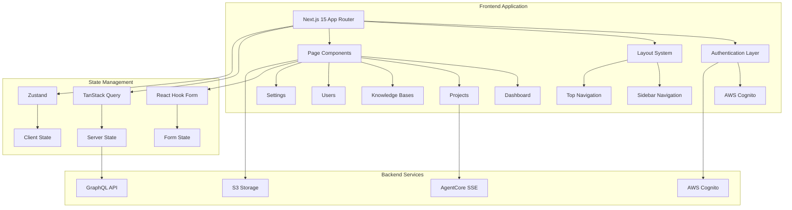

# Design Document

## Overview

The BidOps.ai frontend is a sophisticated Next.js 15 application that provides a comprehensive bid automation platform. The application features a modern, responsive design with real-time AI agent interactions, role-based access control, and advanced document management capabilities. The architecture emphasizes performance, security, and user experience through careful separation of concerns and modern React patterns.

## Architecture

### High-Level Architecture



### Technology Stack

- **Framework**: Next.js 15 with App Router
- **UI Library**: React 18 with TypeScript
- **Styling**: Tailwind CSS with CSS custom properties for theming
- **Component Library**: shadcn/ui components
- **State Management**: 
  - TanStack Query for server state
  - Zustand for client state
  - React Hook Form for form state
- **Authentication**: NextAuth.js with AWS Cognito
- **Real-time**: Server-Sent Events (SSE) for agent streaming
- **File Uploads**: Direct S3 uploads via presigned URLs
- **Rich Text Editing**: TipTap editor with custom extensions

### Folder Structure Rationale

The application follows Next.js 15 App Router conventions with clear separation of concerns:

- **Route Groups**: `(auth)` and `(main)` separate authentication and main app layouts
- **Component Organization**: Grouped by feature domain (projects, users, etc.)
- **Shared Components**: Common UI components in `components/ui` and `components/common`
- **Type Safety**: Comprehensive TypeScript types organized by domain
- **Utilities**: Helper functions, validation schemas, and constants

## Components and Interfaces

### Core Layout Components

#### MainLayout Component
```typescript
interface MainLayoutProps {
  children: React.ReactNode;
}

// Combines TopNavigation, Sidebar, and content area
// Handles responsive behavior and theme switching
// Manages sidebar collapse state via Zustand
```

#### TopNavigation Component
```typescript
interface TopNavigationProps {
  user: User;
  notifications: Notification[];
  onLanguageChange: (language: string) => void;
}

// Features:
// - Animated AI Assistant icon with theme-aware colors
// - Notification dropdown with unread count badge
// - Language selector with persistence
// - Logo and branding
```

#### Sidebar Component
```typescript
interface SidebarProps {
  isCollapsed: boolean;
  onToggle: () => void;
  userRole: UserRole;
}

// Features:
// - Role-based menu filtering
// - Collapsible with animation
// - Mobile drawer variant
// - User section with profile and logout
```

### Authentication Components

#### SignInForm Component
```typescript
interface SignInFormProps {
  onSuccess: (user: User) => void;
  onError: (error: string) => void;
}

// Features:
// - Username/password authentication
// - Google OAuth integration
// - Form validation with React Hook Form
// - Loading states and error handling
```

#### AuthBackground Component
```typescript
// Futuristic CSS animations with:
// - Particle effects
// - Gradient animations
// - Theme-aware color schemes
// - Performance-optimized animations
```

### Project Management Components

#### ProjectForm Component
```typescript
interface ProjectFormProps {
  onSubmit: (data: CreateProjectData) => void;
  knowledgeBases: KnowledgeBase[];
  users: User[];
}

interface CreateProjectData {
  name: string;
  description?: string;
  deadline?: Date;
  documents: File[];
  knowledgeBaseIds: string[];
  memberIds: string[];
}

// Features:
// - Multi-step form with validation
// - File upload with drag-and-drop
// - Multi-select for knowledge bases and users
// - Progress indication
```

#### WorkflowProgress Component
```typescript
interface WorkflowStep {
  id: string;
  name: string;
  status: 'Open' | 'InProgress' | 'Waiting' | 'Completed' | 'Failed';
  progress?: number;
}

interface WorkflowProgressProps {
  steps: WorkflowStep[];
  currentStep: string;
}

// Features:
// - 8-step progress visualization
// - Animated step indicators
// - Status-based styling
// - Progress percentages
```

#### AgentChatInterface Component
```typescript
interface ChatMessage {
  id: string;
  type: 'agent' | 'user';
  content: string;
  timestamp: Date;
  metadata?: Record<string, any>;
}

interface AgentChatInterfaceProps {
  projectId: string;
  messages: ChatMessage[];
  isStreaming: boolean;
  onSendMessage: (message: string) => void;
}

// Features:
// - Real-time SSE streaming
// - Message history persistence
// - Typing indicators
// - Markdown rendering for agent responses
```

### Artifact Management Components

#### ArtifactTile Component
```typescript
interface Artifact {
  id: string;
  type: 'worddoc' | 'pdf' | 'excel' | 'ppt';
  category: 'document' | 'q_and_a' | 'excel';
  title: string;
  tags: string[];
  metadata: ArtifactMetadata;
}

interface ArtifactTileProps {
  artifact: Artifact;
  onClick: (artifact: Artifact) => void;
}

// Features:
// - Type-specific icons and styling
// - Tag display
// - Click handling for editing
// - Status indicators
```

#### DocumentEditor Component
```typescript
interface DocumentEditorProps {
  content: TipTapContent;
  onChange: (content: TipTapContent) => void;
  onSave: () => void;
  readOnly?: boolean;
}

// Features:
// - TipTap rich text editor
// - Custom extensions for headings, lists, tables
// - Collaborative editing support (future)
// - Auto-save functionality
```

#### QAEditor Component
```typescript
interface QAItem {
  question: string;
  proposedAnswer: string;
  pastAnswers: Array<{
    answer: string;
    referenceLink?: string;
  }>;
}

interface QAEditorProps {
  items: QAItem[];
  onChange: (items: QAItem[]) => void;
  onSave: () => void;
}

// Features:
// - Question/answer pair editing
// - Past answers reference
// - Add/remove Q&A items
// - Validation and formatting
```

### Knowledge Base Components

#### KnowledgeBaseList Component
```typescript
interface KnowledgeBaseListProps {
  globalKBs: KnowledgeBase[];
  localKBs: KnowledgeBase[];
  userRole: UserRole;
  onCreateKB: () => void;
  onViewKB: (kb: KnowledgeBase) => void;
}

// Features:
// - Separate sections for global/local KBs
// - Tile-based layout
// - Role-based action filtering
// - Empty states with create actions
```

### User Management Components

#### UserList Component
```typescript
interface UserListProps {
  users: User[];
  onCreateUser: () => void;
  onEditUser: (user: User) => void;
  onDeleteUser: (userId: string) => void;
  currentUserRole: UserRole;
}

// Features:
// - Searchable user table
// - Quick action buttons
// - Role-based permission filtering
// - Bulk operations support
```

## Data Models

### Core Types

```typescript
// User and Authentication
interface User {
  id: string;
  email: string;
  username: string;
  firstName: string;
  lastName: string;
  profileImageUrl?: string;
  preferredLanguage: string;
  themePreference: string;
  emailVerified: boolean;
  cognitoUserId: string;
  roles: UserRole[];
  createdAt: Date;
  updatedAt: Date;
  lastLogin?: Date;
}

interface UserRole {
  id: string;
  name: 'Admin' | 'Drafter' | 'Bidder' | 'KB-Admin' | 'KB-View';
  description: string;
  permissions: Permission[];
}

// Project Management
interface Project {
  id: string;
  name: string;
  description?: string;
  status: 'Open' | 'InProgress' | 'Completed' | 'Failed';
  value?: number;
  deadline?: Date;
  progressPercentage: number;
  createdBy: string;
  completedBy?: string;
  members: ProjectMember[];
  documents: ProjectDocument[];
  artifacts: Artifact[];
  workflowExecution?: WorkflowExecution;
  createdAt: Date;
  updatedAt: Date;
  completedAt?: Date;
}

interface ProjectDocument {
  id: string;
  projectId: string;
  fileName: string;
  filePath: string;
  fileType: string;
  fileSize: number;
  rawFileLocation: string;
  processedFileLocation?: string;
  uploadedBy: string;
  uploadedAt: Date;
  metadata: Record<string, any>;
}

// Workflow and Agents
interface WorkflowExecution {
  id: string;
  projectId: string;
  status: 'Open' | 'InProgress' | 'Waiting' | 'Completed' | 'Failed';
  initiatedBy: string;
  handledBy: string;
  completedBy?: string;
  startedAt: Date;
  completedAt?: Date;
  lastUpdatedAt: Date;
  workflowConfig: Record<string, any>;
  errorLog?: Record<string, any>;
  errorMessage?: string;
  results?: Record<string, any>;
  tasks: AgentTask[];
}

interface AgentTask {
  id: string;
  workflowExecutionId: string;
  agent: string;
  status: 'Open' | 'InProgress' | 'Waiting' | 'Completed' | 'Failed';
  sequenceOrder: number;
  inputData?: Record<string, any>;
  outputData?: Record<string, any>;
  taskConfig: Record<string, any>;
  errorLog?: Record<string, any>;
  errorMessage?: string;
  startedAt?: Date;
  completedAt?: Date;
  executionTimeSeconds?: number;
}

// Knowledge Base
interface KnowledgeBase {
  id: string;
  name: string;
  description: string;
  scope: 'Global' | 'Local';
  projectId?: string;
  documentCount: number;
  createdBy: string;
  vectorStoreId: string;
  documents: KnowledgeBaseDocument[];
  permissions: KnowledgeBasePermission[];
  createdAt: Date;
  updatedAt: Date;
}

// Artifacts
interface Artifact {
  id: string;
  projectId: string;
  name: string;
  type: 'worddoc' | 'pdf' | 'ppt' | 'excel';
  category: 'document' | 'q_and_a' | 'excel';
  status: string;
  createdBy: string;
  approvedBy?: string;
  versions: ArtifactVersion[];
  createdAt: Date;
  approvedAt?: Date;
}

interface ArtifactVersion {
  id: string;
  artifactId: string;
  versionNumber: number;
  content: TipTapContent | QAContent | ExcelContent;
  location?: string;
  createdBy: string;
  createdAt: Date;
}

// Editor Content Types
interface TipTapContent {
  type: 'doc';
  content: Array<{
    type: string;
    attrs?: Record<string, any>;
    content?: Array<any>;
  }>;
}

interface QAContent {
  q_and_a: Array<{
    question: string;
    proposedAnswer: string;
    pastAnswers: Array<{
      answer: string;
      referenceLink?: string;
    }>;
  }>;
}
```

### State Management Schemas

```typescript
// Zustand Stores
interface UIStore {
  theme: 'light' | 'dark' | 'deloitte' | 'futuristic';
  language: string;
  sidebarCollapsed: boolean;
  setTheme: (theme: string) => void;
  setLanguage: (language: string) => void;
  toggleSidebar: () => void;
}

interface ArtifactDraftStore {
  drafts: Record<string, any>;
  setDraft: (artifactId: string, content: any) => void;
  getDraft: (artifactId: string) => any;
  clearDraft: (artifactId: string) => void;
  clearAllDrafts: () => void;
}

// TanStack Query Keys
const queryKeys = {
  projects: ['projects'] as const,
  project: (id: string) => ['projects', id] as const,
  users: ['users'] as const,
  user: (id: string) => ['users', id] as const,
  knowledgeBases: ['knowledgeBases'] as const,
  knowledgeBase: (id: string) => ['knowledgeBases', id] as const,
  artifacts: (projectId: string) => ['artifacts', projectId] as const,
  workflowExecution: (projectId: string) => ['workflowExecution', projectId] as const,
  notifications: ['notifications'] as const,
  bidStatistics: ['bidStatistics'] as const,
};
```

## Error Handling

### Error Boundary Strategy

```typescript
interface ErrorBoundaryState {
  hasError: boolean;
  error?: Error;
  errorInfo?: ErrorInfo;
}

// Global error boundary for unhandled React errors
// Feature-specific error boundaries for isolated error handling
// Fallback UI components for graceful degradation
```

### API Error Handling

```typescript
interface APIError {
  message: string;
  code: string;
  details?: Record<string, any>;
}

// Centralized error handling in TanStack Query
// User-friendly error messages
// Retry logic for transient failures
// Offline detection and queuing
```

### Form Validation

```typescript
// Zod schemas for runtime validation
// React Hook Form integration
// Real-time validation feedback
// Accessibility-compliant error messages
```

## Testing Strategy

### Unit Testing
- Component testing with React Testing Library
- Hook testing for custom hooks
- Utility function testing
- State management testing

### Integration Testing
- API integration testing
- Authentication flow testing
- File upload testing
- Real-time features testing

### End-to-End Testing
- Critical user journeys
- Cross-browser compatibility
- Mobile responsiveness
- Performance testing

### Accessibility Testing
- Screen reader compatibility
- Keyboard navigation
- Color contrast validation
- ARIA compliance

## Performance Optimization

### Code Splitting
- Route-based code splitting with Next.js
- Component-level lazy loading
- Dynamic imports for heavy components

### Caching Strategy
- TanStack Query for server state caching
- Browser caching for static assets
- Service worker for offline functionality

### Bundle Optimization
- Tree shaking for unused code elimination
- Image optimization with Next.js Image component
- Font optimization and preloading

### Runtime Performance
- React.memo for expensive components
- useMemo and useCallback for expensive computations
- Virtual scrolling for large lists
- Debounced search inputs

## Security Considerations

### Authentication Security
- AWS Cognito integration with secure token handling
- Session management with automatic refresh
- Secure logout with token invalidation

### Data Protection
- Input sanitization and validation
- XSS protection with Content Security Policy
- CSRF protection for state-changing operations
- Secure file upload with type validation

### Access Control
- Role-based UI rendering
- Route protection with middleware
- API request authorization
- Sensitive data masking

## Deployment and Infrastructure

### Build Process
- Next.js production build optimization
- Environment-specific configuration
- Asset optimization and compression

### Hosting Strategy
- Static site generation where possible
- Server-side rendering for dynamic content
- CDN integration for global performance

### Monitoring and Analytics
- Error tracking and reporting
- Performance monitoring
- User analytics and behavior tracking
- Real-time system health monitoring