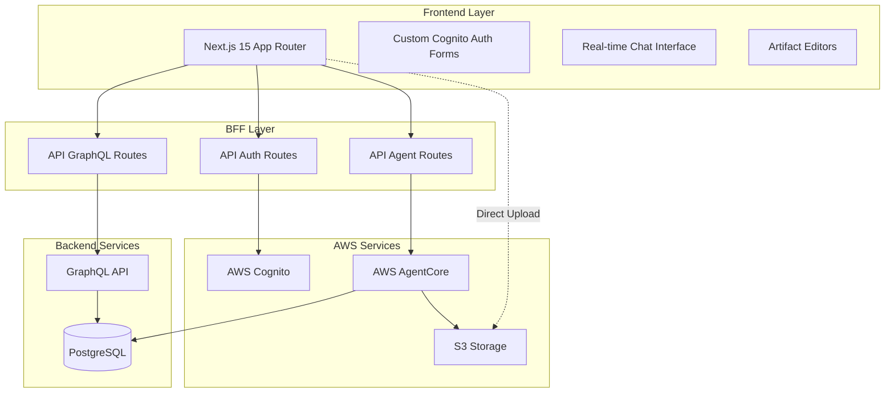
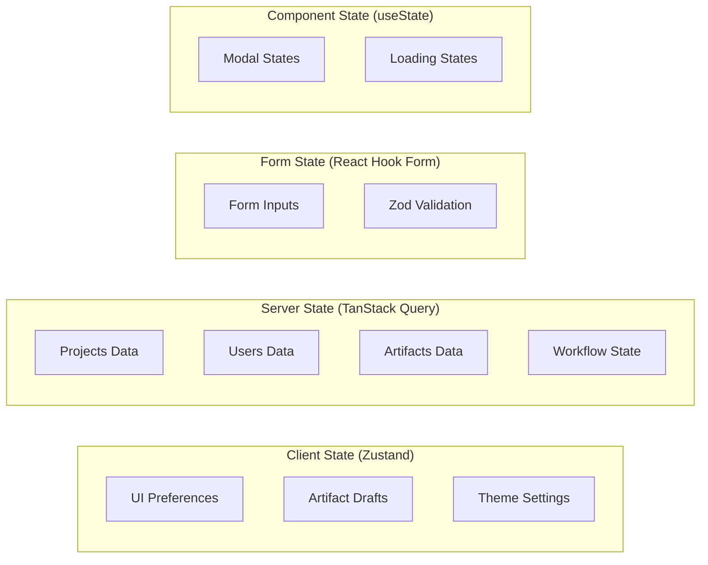
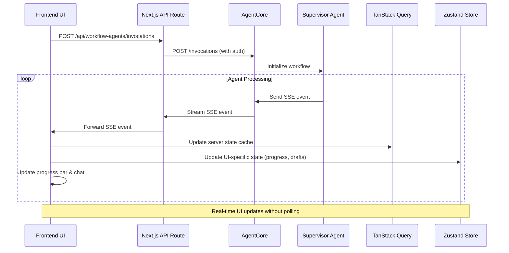
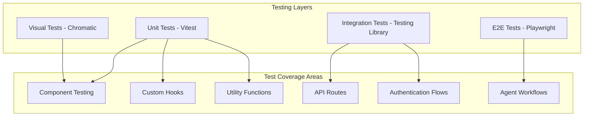

# Design Document

## Overview

This document outlines the technical design for bidops.ai, a cutting-edge AI-powered bid automation platform built with Next.js 15, React 19, and TypeScript. The application features a futuristic interface that combines modern web technologies with AWS services to create an end-to-end bid preparation workflow orchestrated by AI agents.

The system architecture follows a Backend-for-Frontend (BFF) pattern using Next.js API routes to securely handle sensitive operations, while the frontend provides a responsive, real-time interface for users to interact with AI agents through a chat-based workflow.

## Architecture

### High-Level Architecture



### Component Architecture

The application follows a modular component architecture with clear separation of concerns:

- **Layout Components**: Handle navigation, sidebar, and overall page structure
- **Feature Components**: Implement specific business logic (projects, knowledge bases, users)
- **UI Components**: Reusable shadcn/ui components with custom styling
- **Editor Components**: Specialized editors for different artifact types
- **Provider Components**: Manage global state and context

### State Management Architecture



## Components and Interfaces

### Core Components Structure

```
src/components/
├── ui/                                        # shadcn/ui components
│   ├── button.tsx
│   ├── card.tsx
│   ├── dialog.tsx
│   ├── input.tsx
│   ├── label.tsx
│   ├── select.tsx
│   ├── textarea.tsx
│   ├── checkbox.tsx
│   ├── radio-group.tsx
│   ├── switch.tsx
│   ├── badge.tsx
│   ├── toast.tsx
│   ├── toaster.tsx
│   ├── tooltip.tsx
│   ├── dropdown-menu.tsx
│   ├── tabs.tsx
│   ├── table.tsx
│   ├── alert.tsx
│   ├── alert-dialog.tsx
│   ├── avatar.tsx
│   ├── popover.tsx
│   ├── progress.tsx
│   ├── separator.tsx
│   ├── skeleton.tsx
│   ├── sheet.tsx                              # Mobile drawer/sidebar
│   ├── scroll-area.tsx
│   └── command.tsx                            # Command palette (Cmd+K style search)
├── layout/
│   ├── TopNavigation/
│   │   ├── TopNavigation.tsx                  # Top bar: logo, AI assistant, notifications, language selector
│   │   ├── AIAssistantIcon.tsx                # Glowing/breathing animated icon (changes with theme)
│   │   ├── NotificationsIcon.tsx              # Bell icon with unread count badge
│   │   ├── LanguageSelector.tsx               # Dropdown: EN (US), EN (AU), etc.
│   │   └── Logo.tsx                           # Company logo (top-left corner)
│   ├── Sidebar/
│   │   ├── Sidebar.tsx                        # Left sidebar: collapsible, menu items + user section
│   │   ├── SidebarMenu.tsx                    # Menu: Dashboard, Projects, KBs, Users (filtered by role)
│   │   ├── SidebarMenuItem.tsx                # Single menu item with icon, label, sub-items
│   │   ├── SidebarUserSection.tsx             # Bottom: user avatar, name, role, settings, logout
│   │   └── MobileSidebar.tsx                  # Mobile: burger menu icon + drawer (using sheet)
│   └── MainLayout/
│       └── MainLayout.tsx                     # Main layout wrapper: combines top nav + sidebar + content
├── auth/
│   ├── SignInForm/
│   │   └── SignInForm.tsx                     # Cognito username/password + Google sign-in
│   ├── SignUpForm/
│   │   └── SignUpForm.tsx                     # Cognito user registration form
│   ├── AuthBackground/
│   │   └── AuthBackground.tsx                 # Full-screen futuristic CSS animations
│   └── SocialAuth/
│       └── GoogleSignIn.tsx                   # Google OAuth button for Cognito
├── dashboard/
│   ├── StatsCards/
│   │   ├── StatsCards.tsx                     # Container for stat cards
│   │   └── StatCard.tsx                       # Single stat: Submitted Bids, Won Bids, Total Value, Active Projects
│   └── ActiveProjects/
│       ├── ActiveProjectsList.tsx             # List of user's active/assigned projects
│       ├── ProjectCard.tsx                    # Project card with title, status, deadline
│       └── EmptyProjectsState.tsx             # Empty state: button to create first project
├── projects/
│   ├── ProjectList/
│   │   ├── ProjectList.tsx                    # Main list component with table/grid view
│   │   ├── ProjectListItem.tsx                # Single row/card: name, status, deadline, members
│   │   ├── ProjectFilters.tsx                 # Filters: status, date range, assigned user
│   │   └── ProjectSearch.tsx                  # Search bar for projects
│   ├── ProjectForm/
│   │   ├── ProjectForm.tsx                    # New project form container
│   │   ├── ProjectBasicInfo.tsx               # Name, description, deadline inputs
│   │   ├── DocumentUpload.tsx                 # Upload: Word, Excel, PDF, Audio, Video (to S3 via presigned URL)
│   │   ├── KnowledgeBaseSelector.tsx          # Multi-select: search and select KBs (local/global)
│   │   └── ProjectMemberSelector.tsx          # Add users to project
│   ├── ProjectWorkflow/
│   │   ├── WorkflowProgress.tsx               # Top progress bar: 8 steps (Parse → Analysis → Content → Compliance → QA → Comms → Submission)
│   │   ├── WorkflowStep.tsx                   # Single step with status indicator
│   │   └── WorkflowStepIndicator.tsx          # Animated icon for each step (Open, InProgress, Waiting, Completed, Failed)
│   ├── AgentChat/
│   │   ├── AgentChatInterface.tsx             # Chat UI: messages + input (SSE streaming from AgentCore)
│   │   ├── ChatMessage.tsx                    # Single message: agent or user, with timestamp
│   │   ├── ChatInput.tsx                      # Text input + send button (disabled while streaming)
│   │   ├── StreamingIndicator.tsx             # Dots animation while agent is streaming
│   │   └── AgentThinking.tsx                  # Visual indicator when agent is processing
│   ├── ArtifactViewer/
│   │   ├── ArtifactTile.tsx                   # Clickable tile for each artifact (streamed from agents)
│   │   ├── ArtifactModal.tsx                  # Popup window for editing artifacts
│   │   ├── ArtifactRenderer.tsx               # Renders different artifact types appropriately
│   │   └── editors/
│   │       ├── DocumentEditor/
│   │       │   └── DocumentEditor.tsx         # Rich text editor for worddoc/pdf (TipTap JSON format)
│   │       ├── QAEditor/
│   │       │   ├── QAEditor.tsx               # Q&A format: question, proposed_answer, past_answers
│   │       │   └── QAItem.tsx                 # Single Q&A item with editable fields
│   │       └── ExcelEditor/
│   │           └── ExcelTableEditor.tsx       # Editable table/spreadsheet component (future)
│   ├── ProjectDetails/
│   │   ├── ProjectHeader.tsx                  # Project name, status, actions (edit, delete)
│   │   ├── ProjectInfo.tsx                    # Description, deadline, created date, progress
│   │   └── ProjectMembers.tsx                 # List of assigned users with avatars, add/remove
│   └── EmailDraftReview/
│       └── EmailDraftReview.tsx               # Review email draft from Submission Agent before sending
├── editor/                                    # Generic rich text editor (implementation-agnostic)
│   ├── RichTextEditor.tsx                     # Main editor component (currently uses TipTap)
│   ├── MenuBar/
│   │   ├── MenuBar.tsx                        # Toolbar with formatting options
│   │   ├── BlockFormatMenu.tsx                # Headings, paragraphs, code blocks
│   │   ├── TextStyleMenu.tsx                  # Bold, italic, underline, strike, code
│   │   ├── ListMenu.tsx                       # Bullet list, ordered list, task list
│   │   ├── AlignmentMenu.tsx                  # Left, center, right, justify
│   │   └── InsertMenu.tsx                     # Insert: image, video, table, horizontal rule
│   ├── BubbleMenu/
│   │   └── CustomBubbleMenu.tsx               # Floating menu on text selection
│   ├── FloatingMenu/
│   │   └── CustomFloatingMenu.tsx             # Floating menu on empty lines (+ button)
│   ├── extensions/
│   │   ├── custom-heading.ts                  # Custom heading styles
│   │   ├── custom-paragraph.ts                # Custom paragraph formatting
│   │   ├── custom-list.ts                     # Custom list behavior
│   │   ├── custom-table.ts                    # Custom table functionality
│   │   ├── highlight.ts                       # Text highlighting
│   │   ├── mentions.ts                        # @mentions support
│   │   └── collaboration.ts                   # Real-time collaboration (future)
│   └── nodes/
│       ├── ImageNode.tsx                      # Custom image node with resize
│       ├── VideoNode.tsx                      # Custom video embed node
│       └── CalloutNode.tsx                    # Callout/admonition blocks
├── knowledge-bases/
│   ├── KnowledgeBaseList/
│   │   ├── KnowledgeBaseList.tsx              # Two sections: Global KBs + Local KBs
│   │   ├── KnowledgeBaseTile.tsx              # Tile: name, description, type, document count, view button
│   │   └── EmptyKnowledgeBaseState.tsx        # Empty state with create KB button
│   ├── KnowledgeBaseForm/
│   │   ├── KnowledgeBaseForm.tsx              # Create KB form container
│   │   ├── KBBasicInfo.tsx                    # Name, description inputs
│   │   ├── KBTypeSelector.tsx                 # Radio: Global or Local
│   │   ├── KBProjectSelector.tsx              # Dropdown: select project (if Local selected)
│   │   └── KBDocumentUpload.tsx               # Upload documents to KB (S3 via presigned URL)
│   └── KnowledgeBaseDetails/
│       ├── KBDetails.tsx                      # KB name, description, type, created date
│       ├── KBDocumentList.tsx                 # List all documents in KB
│       └── KBDocumentSearch.tsx               # Search documents within KB
├── users/
│   ├── UserList/
│   │   ├── UserList.tsx                       # Table of all users
│   │   ├── UserListItem.tsx                   # Row: avatar, name, email, role, status
│   │   ├── UserSearch.tsx                     # Search users by name, email, project
│   │   └── UserQuickActions.tsx               # Quick action buttons: view, edit, delete
│   ├── UserForm/
│   │   ├── UserForm.tsx                       # Add/edit user form (creates in Cognito user pool)
│   │   ├── UserBasicInfo.tsx                  # Name, email, password inputs
│   │   ├── UserRoleSelector.tsx               # Dropdown: Admin, Drafter, Bidder, KB-Admin, KB-View
│   │   └── ProfileImageUpload.tsx             # Upload user profile image (to S3)
│   └── UserDetails/
│       ├── UserProfile.tsx                    # Avatar, name, email, bio
│       ├── UserRolesPermissions.tsx           # Display roles and permissions
│       └── UserProjects.tsx                   # List of assigned projects with add/remove
├── settings/
│   ├── AgentConfiguration/
│   │   ├── AgentList.tsx                      # List of all agents (Supervisor, Parser, Analysis, Content, Compliance, QA, Comms, Submission)
│   │   ├── AgentConfigForm.tsx                # Configure single agent: model, temperature, max tokens
│   │   └── AgentModelSettings.tsx             # Model-specific settings (Claude, GPT, etc.)
│   ├── Integrations/
│   │   ├── IntegrationsList.tsx               # List of available integrations
│   │   └── SlackIntegration.tsx               # Slack configuration: webhook URL, channel, token
│   └── SystemSettings/
│       ├── TwoFactorSettings.tsx              # Enable/disable 2FA via Cognito
│       ├── TimezoneSettings.tsx               # Select timezone for the app
│       ├── ThemeSettings.tsx                  # Theme selector: Light, Dark, Deloitte, Futuristic
│       ├── LanguageSettings.tsx               # Language selector: EN (US), EN (AU), etc.
│       └── DataRetentionSettings.tsx          # Dropdown: retention period (default 30 days)
├── common/
│   ├── FileUpload/
│   │   ├── FileUpload.tsx                     # Main file upload component (handles S3 presigned URLs)
│   │   ├── FileDropzone.tsx                   # Drag & drop zone for files
│   │   └── FilePreview.tsx                    # Preview uploaded files before submission
│   ├── Pagination/
│   │   └── Pagination.tsx                     # Page navigation controls
│   ├── SearchBar/
│   │   └── SearchBar.tsx                      # Reusable search input with debounce
│   ├── ErrorBoundary/
│   │   └── ErrorBoundary.tsx                  # Catch React errors and show fallback UI
│   ├── LoadingSpinner/
│   │   └── LoadingSpinner.tsx                 # Loading indicator
│   └── ProgressBar/
│       └── ProgressBar.tsx                    # Progress bar component
└── providers/
    └── Providers.tsx                          # Single provider wrapper (TanStack Query + Theme)
```

### Key Interface Definitions

#### Agent Workflow Interfaces

```typescript
interface WorkflowExecution {
  id: string
  projectId: string
  status: WorkflowStatus
  initiatedBy: User
  handledBy?: User
  completedBy?: User
  startedAt: Date
  completedAt?: Date
  lastUpdatedAt: Date
  workflowConfig?: JSON
  errorLog?: JSON
  errorMessage?: string
  results?: JSON
  agentTasks: AgentTask[]
}

interface AgentTask {
  id: string
  workflowExecutionId: string
  agent: AgentType
  status: AgentTaskStatus
  sequenceOrder: number
  inputData?: JSON
  outputData?: JSON
  taskConfig?: JSON
  errorLog?: JSON
  errorMessage?: string
  startedAt?: Date
  completedAt?: Date
  executionTimeSeconds?: number
}

enum AgentType {
  SUPERVISOR = 'SUPERVISOR',
  PARSER = 'PARSER',
  ANALYSIS = 'ANALYSIS',
  CONTENT = 'CONTENT',
  KNOWLEDGE = 'KNOWLEDGE',
  COMPLIANCE = 'COMPLIANCE',
  QA = 'QA',
  COMMS = 'COMMS',
  SUBMISSION = 'SUBMISSION'
}

enum AgentTaskStatus {
  OPEN = 'OPEN',
  IN_PROGRESS = 'IN_PROGRESS',
  WAITING = 'WAITING',
  COMPLETED = 'COMPLETED',
  FAILED = 'FAILED'
}
```

#### Artifact Interfaces

```typescript
interface Artifact {
  id: string
  projectId: string
  name: string
  type: ArtifactType
  category: ArtifactCategory
  status: ArtifactStatus
  createdBy: User
  approvedBy?: User
  createdAt: Date
  approvedAt?: Date
  versions: ArtifactVersion[]
  latestVersion?: ArtifactVersion
}

interface ArtifactVersion {
  id: string
  artifactId: string
  versionNumber: number
  content: JSON // TipTap JSON or Q&A format
  location?: string // S3 location
  createdBy: User
  createdAt: Date
}

enum ArtifactType {
  WORDDOC = 'WORDDOC',
  PDF = 'PDF',
  PPT = 'PPT',
  EXCEL = 'EXCEL'
}

enum ArtifactCategory {
  DOCUMENT = 'DOCUMENT',
  Q_AND_A = 'Q_AND_A',
  EXCEL = 'EXCEL'
}
```

#### SSE Event Interfaces

```typescript
interface SSEEvent {
  type: SSEEventType
  data: any
  timestamp: Date
}

interface ProgressResetData {
  resetToStep: AgentType
  reason: 'user_feedback_analysis' | 'compliance_failed' | 'qa_failed' | 'user_content_edits' | 'parser_failed'
  affectedSteps: AgentType[]
  message: string
  previousStep?: AgentType
  userInput?: string
}

interface WorkflowNavigationData {
  currentStep: AgentType
  previousStep?: AgentType
  nextStep?: AgentType
  direction: 'forward' | 'backward' | 'restart'
  reason: string
  affectedTasks: string[]
}

interface AgentFailedData {
  agent: AgentType
  error: string
  errorCode: string
  canRetry: boolean
  suggestedAction: 'retry' | 'skip' | 'restart_workflow' | 'manual_intervention'
  affectedSteps?: AgentType[]
}

interface AwaitingFeedbackData {
  agent: AgentType
  content: string
  contentType: 'markdown' | 'json' | 'text'
  feedbackType: 'analysis_review' | 'artifact_review' | 'permission_request'
  options?: string[]
}

interface AwaitingReviewData {
  artifacts: Artifact[]
  message: string
  canProceed: boolean
  requiresAllArtifacts: boolean
}

enum SSEEventType {
  WORKFLOW_CREATED = 'workflow_created',
  PARSER_STARTED = 'parser_started',
  PARSER_COMPLETED = 'parser_completed',
  PARSER_FAILED = 'parser_failed',
  PARSER_RESTART = 'parser_restart',
  ANALYSIS_STARTED = 'analysis_started',
  ANALYSIS_COMPLETED = 'analysis_completed',
  ANALYSIS_FAILED = 'analysis_failed',
  ANALYSIS_RESTARTED = 'analysis_restarted',
  CONTENT_STARTED = 'content_started',
  CONTENT_COMPLETED = 'content_completed',
  CONTENT_FAILED = 'content_failed',
  COMPLIANCE_STARTED = 'compliance_started',
  COMPLIANCE_COMPLETED = 'compliance_completed',
  COMPLIANCE_FAILED = 'compliance_failed',
  QA_STARTED = 'qa_started',
  QA_COMPLETED = 'qa_completed',
  QA_FAILED = 'qa_failed',
  ARTIFACTS_READY = 'artifacts_ready',
  AWAITING_FEEDBACK = 'awaiting_feedback',
  AWAITING_REVIEW = 'awaiting_review',
  RETURNING_TO_CONTENT = 'returning_to_content',
  CONTENT_REVISION_CYCLE = 'content_revision_cycle',
  COMMS_PERMISSION = 'comms_permission',
  COMMS_STARTED = 'comms_started',
  COMMS_COMPLETED = 'comms_completed',
  COMMS_FAILED = 'comms_failed',
  SUBMISSION_PERMISSION = 'submission_permission',
  SUBMISSION_STARTED = 'submission_started',
  SUBMISSION_COMPLETED = 'submission_completed',
  SUBMISSION_FAILED = 'submission_failed',
  EMAIL_DRAFT = 'email_draft',
  WORKFLOW_COMPLETED = 'workflow_completed',
  WORKFLOW_COMPLETED_WITHOUT_COMMS = 'workflow_completed_without_comms',
  WORKFLOW_COMPLETED_WITHOUT_SUBMISSION = 'workflow_completed_without_submission'
}
```

## Data Models

### Database Schema Integration

The frontend integrates with the PostgreSQL database through GraphQL queries and mutations. Key data models include:

#### User Management
- **User**: Core user information with Cognito integration
- **Role**: Role-based access control (Admin, Drafter, Bidder, KB-Admin, KB-View)
- **Permission**: Granular permissions for resources and actions

#### Project Management
- **Project**: Bid projects with status tracking and progress
- **ProjectDocument**: Document metadata with S3 locations
- **ProjectMember**: User assignments to projects

#### Knowledge Management
- **KnowledgeBase**: Global and local knowledge repositories
- **KnowledgeBaseDocument**: Documents within knowledge bases
- **KnowledgeBasePermission**: Access control for knowledge bases

#### Workflow Management
- **WorkflowExecution**: Agent workflow orchestration
- **AgentTask**: Individual agent task tracking
- **Artifact**: Generated bid documents and content
- **ArtifactVersion**: Version control for artifacts

### Client-Side Data Models

#### Zustand Store Schemas

```typescript
interface UIStore {
  theme: 'light' | 'dark' | 'deloitte' | 'futuristic'
  language: 'en-US' | 'en-AU'
  sidebarCollapsed: boolean
  setTheme: (theme: string) => void
  setLanguage: (language: string) => void
  toggleSidebar: () => void
}

interface ArtifactDraftStore {
  drafts: Record<string, ArtifactDraft>
  setDraft: (artifactId: string, content: JSON) => void
  getDraft: (artifactId: string) => ArtifactDraft | undefined
  clearDraft: (artifactId: string) => void
  clearAllDrafts: () => void
}

interface ArtifactDraft {
  artifactId: string
  content: JSON
  lastModified: Date
  hasChanges: boolean
}
```

## Agent SSE Communication Design

### SSE Architecture Overview

The application implements a sophisticated Server-Sent Events (SSE) system to handle real-time communication between the AI agents and the frontend interface. This design ensures users receive immediate feedback during the complex multi-agent workflow.



### SSE Event Processing Pipeline

#### 1. SSE Connection Management

```typescript
class AgentSSEManager {
  private eventSource: EventSource | null = null
  private reconnectAttempts = 0
  private maxReconnectAttempts = 5
  private baseReconnectDelay = 1000
  private queryClient: QueryClient
  private uiStore: UIStore

  constructor(queryClient: QueryClient) {
    this.queryClient = queryClient
  }

  connect(projectId: string, sessionId: string) {
    const url = `/api/workflow-agents/stream?projectId=${projectId}&sessionId=${sessionId}`
    this.eventSource = new EventSource(url)
    
    this.eventSource.onopen = this.handleOpen.bind(this)
    this.eventSource.onmessage = this.handleMessage.bind(this)
    this.eventSource.onerror = this.handleError.bind(this)
  }

  private handleMessage(event: MessageEvent) {
    try {
      const sseEvent: SSEEvent = JSON.parse(event.data)
      this.processSSEEvent(sseEvent)
    } catch (error) {
      console.error('Failed to parse SSE event:', error)
    }
  }

  private processSSEEvent(event: SSEEvent) {
    // Update TanStack Query cache
    this.updateQueryCache(event)
    
    // Update UI state
    this.updateUIState(event)
    
    // Handle specific event types
    this.handleEventType(event)
  }
}
```

#### 2. Event Type Handlers

```typescript
interface SSEEventHandlers {
  [SSEEventType.WORKFLOW_CREATED]: (data: WorkflowCreatedData) => void
  [SSEEventType.PARSER_STARTED]: (data: AgentStartedData) => void
  [SSEEventType.PARSER_COMPLETED]: (data: AgentCompletedData) => void
  [SSEEventType.PARSER_FAILED]: (data: AgentFailedData) => void
  [SSEEventType.PARSER_RESTART]: (data: ProgressResetData) => void
  [SSEEventType.ANALYSIS_STARTED]: (data: AgentStartedData) => void
  [SSEEventType.ANALYSIS_COMPLETED]: (data: AnalysisCompletedData) => void
  [SSEEventType.ANALYSIS_FAILED]: (data: AgentFailedData) => void
  [SSEEventType.ANALYSIS_RESTARTED]: (data: ProgressResetData) => void
  [SSEEventType.CONTENT_STARTED]: (data: AgentStartedData) => void
  [SSEEventType.CONTENT_COMPLETED]: (data: AgentCompletedData) => void
  [SSEEventType.CONTENT_FAILED]: (data: AgentFailedData) => void
  [SSEEventType.COMPLIANCE_STARTED]: (data: AgentStartedData) => void
  [SSEEventType.COMPLIANCE_COMPLETED]: (data: AgentCompletedData) => void
  [SSEEventType.COMPLIANCE_FAILED]: (data: AgentFailedData) => void
  [SSEEventType.QA_STARTED]: (data: AgentStartedData) => void
  [SSEEventType.QA_COMPLETED]: (data: AgentCompletedData) => void
  [SSEEventType.QA_FAILED]: (data: AgentFailedData) => void
  [SSEEventType.AWAITING_FEEDBACK]: (data: AwaitingFeedbackData) => void
  [SSEEventType.ARTIFACTS_READY]: (data: ArtifactsReadyData) => void
  [SSEEventType.AWAITING_REVIEW]: (data: AwaitingReviewData) => void
  [SSEEventType.RETURNING_TO_CONTENT]: (data: ProgressResetData) => void
  [SSEEventType.CONTENT_REVISION_CYCLE]: (data: ProgressResetData) => void
  [SSEEventType.COMMS_PERMISSION]: (data: PermissionRequestData) => void
  [SSEEventType.COMMS_STARTED]: (data: AgentStartedData) => void
  [SSEEventType.COMMS_COMPLETED]: (data: AgentCompletedData) => void
  [SSEEventType.COMMS_FAILED]: (data: AgentFailedData) => void
  [SSEEventType.SUBMISSION_PERMISSION]: (data: PermissionRequestData) => void
  [SSEEventType.SUBMISSION_STARTED]: (data: AgentStartedData) => void
  [SSEEventType.SUBMISSION_COMPLETED]: (data: AgentCompletedData) => void
  [SSEEventType.SUBMISSION_FAILED]: (data: AgentFailedData) => void
  [SSEEventType.EMAIL_DRAFT]: (data: EmailDraftData) => void
  [SSEEventType.WORKFLOW_COMPLETED]: (data: WorkflowCompletedData) => void
  [SSEEventType.WORKFLOW_COMPLETED_WITHOUT_COMMS]: (data: WorkflowCompletedData) => void
  [SSEEventType.WORKFLOW_COMPLETED_WITHOUT_SUBMISSION]: (data: WorkflowCompletedData) => void
}

class SSEEventProcessor {
  private handlers: SSEEventHandlers = {
    [SSEEventType.WORKFLOW_CREATED]: this.handleWorkflowCreated.bind(this),
    [SSEEventType.PARSER_STARTED]: this.handleAgentStarted.bind(this),
    [SSEEventType.PARSER_COMPLETED]: this.handleAgentCompleted.bind(this),
    [SSEEventType.PARSER_FAILED]: this.handleAgentFailed.bind(this),
    [SSEEventType.ANALYSIS_COMPLETED]: this.handleAnalysisCompleted.bind(this),
    [SSEEventType.AWAITING_FEEDBACK]: this.handleAwaitingFeedback.bind(this),
    [SSEEventType.ARTIFACTS_READY]: this.handleArtifactsReady.bind(this),
    [SSEEventType.RETURNING_TO_CONTENT]: this.handleProgressReset.bind(this),
    [SSEEventType.EMAIL_DRAFT]: this.handleEmailDraft.bind(this),
    [SSEEventType.WORKFLOW_COMPLETED]: this.handleWorkflowCompleted.bind(this)
  }

  process(event: SSEEvent) {
    const handler = this.handlers[event.type]
    if (handler) {
      handler(event.data)
    } else {
      console.warn(`No handler for SSE event type: ${event.type}`)
    }
  }

  private handleWorkflowCreated(data: WorkflowCreatedData) {
    // Show progress bar
    // Initialize chat interface
    // Update workflow state
  }

  private handleAgentStarted(data: AgentStartedData) {
    // Update progress bar step
    // Add agent started message to chat
    // Show processing animation
  }

  private handleAnalysisCompleted(data: AnalysisCompletedData) {
    // Add analysis markdown to chat
    // Enable user input for feedback
    // Update progress bar
  }

  private handleArtifactsReady(data: ArtifactsReadyData) {
    // Render artifact tiles in chat
    // Enable artifact editing
    // Update workflow state
  }

  private handleProgressReset(data: ProgressResetData) {
    // Reset progress bar to specified step
    // Clear relevant UI state based on reset type
    // Show reset message in chat
    // Handle different reset scenarios
    this.handleWorkflowReset(data)
  }

  private handleWorkflowReset(data: ProgressResetData) {
    const { resetToStep, reason, affectedSteps } = data
    
    switch (reason) {
      case 'user_feedback_analysis':
        // User feedback requires re-analysis
        this.resetWorkflowToStep('ANALYSIS', ['ANALYSIS'])
        break
      case 'compliance_failed':
        // Compliance standards not met, reset to Content
        this.resetWorkflowToStep('CONTENT', ['CONTENT', 'COMPLIANCE', 'QA'])
        break
      case 'qa_failed':
        // QA standards not met, reset to Content
        this.resetWorkflowToStep('CONTENT', ['CONTENT', 'COMPLIANCE', 'QA'])
        break
      case 'user_content_edits':
        // User made content edits, may need re-review
        this.resetWorkflowToStep('CONTENT', ['CONTENT', 'COMPLIANCE', 'QA'])
        break
      case 'parser_failed':
        // Parser failed, restart from beginning
        this.resetWorkflowToStep('PARSER', ['PARSER', 'ANALYSIS', 'CONTENT', 'COMPLIANCE', 'QA', 'COMMS', 'SUBMISSION'])
        break
    }
  }
}
```

#### 3. Chat Interface Integration

```typescript
interface ChatMessage {
  id: string
  type: 'agent' | 'user' | 'system' | 'artifact' | 'email-draft'
  content: string | JSON
  timestamp: Date
  agentType?: AgentType
  status?: 'sending' | 'sent' | 'failed'
  metadata?: Record<string, any>
}

class ChatMessageManager {
  private messages: ChatMessage[] = []
  private setMessages: (messages: ChatMessage[]) => void

  constructor(setMessages: (messages: ChatMessage[]) => void) {
    this.setMessages = setMessages
  }

  addAgentMessage(event: SSEEvent) {
    const message: ChatMessage = {
      id: generateId(),
      type: 'agent',
      content: this.formatAgentContent(event),
      timestamp: new Date(event.timestamp),
      agentType: this.extractAgentType(event.type),
      metadata: event.data
    }

    this.messages.push(message)
    this.setMessages([...this.messages])
  }

  addArtifactTiles(artifacts: Artifact[]) {
    const message: ChatMessage = {
      id: generateId(),
      type: 'artifact',
      content: artifacts,
      timestamp: new Date(),
      metadata: { artifactCount: artifacts.length }
    }

    this.messages.push(message)
    this.setMessages([...this.messages])
  }

  addEmailDraft(emailData: EmailDraftData) {
    const message: ChatMessage = {
      id: generateId(),
      type: 'email-draft',
      content: emailData,
      timestamp: new Date(),
      metadata: { requiresApproval: true }
    }

    this.messages.push(message)
    this.setMessages([...this.messages])
  }

  addUserMessage(content: string) {
    const message: ChatMessage = {
      id: generateId(),
      type: 'user',
      content,
      timestamp: new Date(),
      status: 'sending'
    }

    this.messages.push(message)
    this.setMessages([...this.messages])
    
    return message.id
  }

  updateMessageStatus(messageId: string, status: 'sent' | 'failed') {
    const message = this.messages.find(m => m.id === messageId)
    if (message) {
      message.status = status
      this.setMessages([...this.messages])
    }
  }
}
```

#### 4. Progress Bar State Management

```typescript
interface WorkflowStep {
  id: string
  name: string
  status: 'pending' | 'active' | 'completed' | 'failed'
  agent: AgentType
  startTime?: Date
  endTime?: Date
  error?: string
}

class WorkflowProgressManager {
  private steps: WorkflowStep[] = [
    { id: 'upload', name: 'Document Upload', status: 'pending', agent: AgentType.SUPERVISOR },
    { id: 'parse', name: 'Document Parsing', status: 'pending', agent: AgentType.PARSER },
    { id: 'analysis', name: 'Analysis', status: 'pending', agent: AgentType.ANALYSIS },
    { id: 'content', name: 'Content Generation', status: 'pending', agent: AgentType.CONTENT },
    { id: 'compliance', name: 'Compliance Check', status: 'pending', agent: AgentType.COMPLIANCE },
    { id: 'qa', name: 'Quality Assurance', status: 'pending', agent: AgentType.QA },
    { id: 'comms', name: 'Communications', status: 'pending', agent: AgentType.COMMS },
    { id: 'submission', name: 'Submission', status: 'pending', agent: AgentType.SUBMISSION }
  ]

  updateStepStatus(agentType: AgentType, status: WorkflowStep['status']) {
    const step = this.steps.find(s => s.agent === agentType)
    if (step) {
      step.status = status
      if (status === 'active') {
        step.startTime = new Date()
      } else if (status === 'completed' || status === 'failed') {
        step.endTime = new Date()
      }
    }
  }

  resetToStep(agentType: AgentType, affectedSteps?: AgentType[]) {
    if (affectedSteps) {
      // Reset only specific steps
      affectedSteps.forEach(stepAgent => {
        const step = this.steps.find(s => s.agent === stepAgent)
        if (step) {
          step.status = 'pending'
          step.startTime = undefined
          step.endTime = undefined
          step.error = undefined
        }
      })
    } else {
      // Reset all steps from this point forward (original behavior)
      const stepIndex = this.steps.findIndex(s => s.agent === agentType)
      if (stepIndex !== -1) {
        for (let i = stepIndex; i < this.steps.length; i++) {
          this.steps[i].status = 'pending'
          this.steps[i].startTime = undefined
          this.steps[i].endTime = undefined
          this.steps[i].error = undefined
        }
      }
    }
  }

  handleComplexWorkflowNavigation(event: SSEEvent) {
    switch (event.type) {
      case SSEEventType.ANALYSIS_RESTARTED:
        // User feedback requires re-analysis
        this.resetToStep(AgentType.ANALYSIS, [AgentType.ANALYSIS])
        this.addWorkflowMessage('Restarting analysis based on your feedback...', 'system')
        break
        
      case SSEEventType.RETURNING_TO_CONTENT:
        // Compliance or QA failed, returning to content generation
        this.resetToStep(AgentType.CONTENT, [AgentType.CONTENT, AgentType.COMPLIANCE, AgentType.QA])
        this.addWorkflowMessage('Returning to content generation to address feedback...', 'system')
        break
        
      case SSEEventType.PARSER_RESTART:
        // Parser failed, restart entire workflow
        this.resetToStep(AgentType.PARSER)
        this.addWorkflowMessage('Restarting document parsing due to errors...', 'system')
        break
        
      case SSEEventType.CONTENT_REVISION_CYCLE:
        // User requested content revision after artifact review
        this.resetToStep(AgentType.CONTENT, [AgentType.CONTENT, AgentType.COMPLIANCE, AgentType.QA])
        this.addWorkflowMessage('Revising content based on your edits...', 'system')
        break
    }
  }

  getProgress(): number {
    const completedSteps = this.steps.filter(s => s.status === 'completed').length
    return (completedSteps / this.steps.length) * 100
  }
}
```

#### 5. TanStack Query Integration

```typescript
// Custom hook for workflow SSE
export function useWorkflowStream(projectId: string, sessionId: string) {
  const queryClient = useQueryClient()
  const [isConnected, setIsConnected] = useState(false)
  const [connectionError, setConnectionError] = useState<string | null>(null)

  useEffect(() => {
    const sseManager = new AgentSSEManager(queryClient, useUIStore.getState())
    
    sseManager.connect(projectId, sessionId)
    
    sseManager.onConnect(() => {
      setIsConnected(true)
      setConnectionError(null)
    })
    
    sseManager.onError((error) => {
      setIsConnected(false)
      setConnectionError(error.message)
    })
    
    sseManager.onMessage((event) => {
      // Update relevant queries based on event type
      switch (event.type) {
        case SSEEventType.WORKFLOW_CREATED:
          queryClient.invalidateQueries({ queryKey: ['workflow', projectId] })
          break
        case SSEEventType.ARTIFACTS_READY:
          queryClient.setQueryData(['artifacts', projectId], event.data.artifacts)
          break
        case SSEEventType.WORKFLOW_COMPLETED:
          queryClient.invalidateQueries({ queryKey: ['project', projectId] })
          queryClient.invalidateQueries({ queryKey: ['workflow', projectId] })
          break
      }
    })

    return () => {
      sseManager.disconnect()
    }
  }, [projectId, sessionId, queryClient])

  return { isConnected, connectionError }
}
```

#### 6. Error Recovery and Resilience

```typescript
class SSEErrorRecovery {
  private reconnectAttempts = 0
  private maxReconnectAttempts = 5
  private baseDelay = 1000
  private maxDelay = 30000

  async handleConnectionError(error: Event, sseManager: AgentSSEManager) {
    console.error('SSE connection error:', error)
    
    if (this.reconnectAttempts < this.maxReconnectAttempts) {
      const delay = Math.min(
        this.baseDelay * Math.pow(2, this.reconnectAttempts),
        this.maxDelay
      )
      
      console.log(`Attempting to reconnect in ${delay}ms (attempt ${this.reconnectAttempts + 1})`)
      
      setTimeout(() => {
        this.reconnectAttempts++
        sseManager.reconnect()
      }, delay)
    } else {
      console.error('Max reconnection attempts reached')
      // Show user notification about connection issues
      // Provide manual refresh option
    }
  }

  reset() {
    this.reconnectAttempts = 0
  }
}
```

#### 7. Comprehensive Workflow State Manager

```typescript
// Comprehensive Workflow State Manager for handling complex navigation scenarios
class WorkflowStateManager {
  private currentStep: AgentType = AgentType.SUPERVISOR
  private stepHistory: AgentType[] = []
  private loopCount: Record<string, number> = {}
  private maxLoopCount = 3

  constructor(
    private progressManager: WorkflowProgressManager,
    private chatManager: ChatMessageManager
  ) {}

  handleWorkflowNavigation(event: SSEEvent) {
    const { type, data } = event

    switch (type) {
      case SSEEventType.ANALYSIS_RESTARTED:
        this.handleBackwardNavigation(AgentType.ANALYSIS, data)
        break
        
      case SSEEventType.RETURNING_TO_CONTENT:
        this.handleBackwardNavigation(AgentType.CONTENT, data)
        break
        
      case SSEEventType.CONTENT_REVISION_CYCLE:
        this.handleRevisionCycle(data)
        break
        
      case SSEEventType.PARSER_RESTART:
        this.handleWorkflowRestart(data)
        break
        
      default:
        this.handleForwardNavigation(type, data)
    }
  }

  private handleBackwardNavigation(targetStep: AgentType, data: ProgressResetData) {
    const { reason, affectedSteps, message } = data
    
    // Track loop count to prevent infinite loops
    const loopKey = `${this.currentStep}->${targetStep}`
    this.loopCount[loopKey] = (this.loopCount[loopKey] || 0) + 1
    
    if (this.loopCount[loopKey] > this.maxLoopCount) {
      this.handleMaxLoopReached(targetStep, reason)
      return
    }

    // Add current step to history
    this.stepHistory.push(this.currentStep)
    
    // Reset progress and UI state
    this.progressManager.resetToStep(targetStep, affectedSteps)
    this.chatManager.addSystemMessage(message, 'workflow_reset')
    
    // Update current step
    this.currentStep = targetStep
    
    // Clear artifact drafts if returning to content
    if (targetStep === AgentType.CONTENT) {
      this.clearArtifactDrafts()
    }
    
    // Show appropriate UI feedback
    this.showWorkflowResetFeedback(targetStep, reason)
  }

  private handleRevisionCycle(data: ProgressResetData) {
    const { userInput, affectedSteps } = data
    
    // Store user edits for the revision
    if (userInput) {
      this.storeUserEditsForRevision(userInput)
    }
    
    // Reset to content generation with user context
    this.handleBackwardNavigation(AgentType.CONTENT, data)
    
    // Add specific message about revision
    this.chatManager.addSystemMessage(
      'Incorporating your edits and regenerating content...',
      'revision_cycle'
    )
  }

  private handleWorkflowRestart(data: ProgressResetData) {
    // Complete workflow restart
    this.currentStep = AgentType.PARSER
    this.stepHistory = []
    this.loopCount = {}
    
    // Reset all progress
    this.progressManager.resetToStep(AgentType.PARSER)
    
    // Clear all state
    this.clearAllDrafts()
    
    // Show restart message
    this.chatManager.addSystemMessage(
      'Restarting the entire workflow due to critical errors...',
      'workflow_restart'
    )
  }

  private handleMaxLoopReached(targetStep: AgentType, reason: string) {
    // Prevent infinite loops by offering manual intervention
    this.chatManager.addSystemMessage(
      `Maximum retry attempts reached for ${targetStep}. Manual intervention may be required.`,
      'max_loop_reached'
    )
    
    // Offer user options
    this.chatManager.addInteractiveMessage({
      type: 'max_loop_intervention',
      message: 'What would you like to do?',
      options: [
        { id: 'continue_anyway', label: 'Continue with current content' },
        { id: 'manual_review', label: 'Review manually' },
        { id: 'restart_workflow', label: 'Restart entire workflow' }
      ]
    })
  }

  getCurrentStep(): AgentType {
    return this.currentStep
  }

  getStepHistory(): AgentType[] {
    return [...this.stepHistory]
  }

  canGoBack(): boolean {
    return this.stepHistory.length > 0
  }

  getLoopCount(fromStep: AgentType, toStep: AgentType): number {
    const loopKey = `${fromStep}->${toStep}`
    return this.loopCount[loopKey] || 0
  }
}
```

This comprehensive SSE design ensures robust real-time communication between the AI agents and the frontend, with proper handling of complex workflow navigation scenarios including backward navigation, revision cycles, infinite loop prevention, and all the complex scenarios shown in the agent flow diagram.

## Error Handling

### Error Boundary Implementation

```typescript
interface ErrorBoundaryState {
  hasError: boolean
  error?: Error
  errorInfo?: ErrorInfo
}

class ErrorBoundary extends Component<PropsWithChildren, ErrorBoundaryState> {
  constructor(props: PropsWithChildren) {
    super(props)
    this.state = { hasError: false }
  }

  static getDerivedStateFromError(error: Error): ErrorBoundaryState {
    return { hasError: true, error }
  }

  componentDidCatch(error: Error, errorInfo: ErrorInfo) {
    console.error('Error caught by boundary:', error, errorInfo)
    // Log to monitoring service
  }

  render() {
    if (this.state.hasError) {
      return <ErrorFallback error={this.state.error} />
    }
    return this.props.children
  }
}
```

### API Error Handling Strategy

```typescript
// API Route Error Handler
export function handleAPIError(error: unknown): Response {
  if (error instanceof AuthenticationError) {
    return new Response(
      JSON.stringify({ error: 'Authentication required' }),
      { status: 401 }
    )
  }
  
  if (error instanceof AuthorizationError) {
    return new Response(
      JSON.stringify({ error: 'Insufficient permissions' }),
      { status: 403 }
    )
  }
  
  if (error instanceof ValidationError) {
    return new Response(
      JSON.stringify({ error: error.message, details: error.details }),
      { status: 400 }
    )
  }
  
  // Log unexpected errors
  console.error('Unexpected API error:', error)
  
  return new Response(
    JSON.stringify({ error: 'Internal server error' }),
    { status: 500 }
  )
}
```

### SSE Error Handling

```typescript
class SSEClient {
  private eventSource: EventSource | null = null
  private reconnectAttempts = 0
  private maxReconnectAttempts = 5
  private reconnectDelay = 1000

  connect(url: string) {
    this.eventSource = new EventSource(url)
    
    this.eventSource.onopen = () => {
      this.reconnectAttempts = 0
    }
    
    this.eventSource.onerror = (event) => {
      console.error('SSE connection error:', event)
      this.handleReconnect()
    }
  }

  private handleReconnect() {
    if (this.reconnectAttempts < this.maxReconnectAttempts) {
      setTimeout(() => {
        this.reconnectAttempts++
        this.connect(this.eventSource?.url || '')
      }, this.reconnectDelay * Math.pow(2, this.reconnectAttempts))
    }
  }
}
```

## Testing Strategy

### Testing Architecture



### Test Implementation Strategy

#### Component Testing
```typescript
// Example component test
describe('ProjectForm', () => {
  it('should validate required fields', async () => {
    render(<ProjectForm />)
    
    const submitButton = screen.getByRole('button', { name: /start/i })
    fireEvent.click(submitButton)
    
    expect(screen.getByText(/project name is required/i)).toBeInTheDocument()
  })
  
  it('should handle file upload', async () => {
    const mockUpload = vi.fn()
    render(<ProjectForm onUpload={mockUpload} />)
    
    const fileInput = screen.getByLabelText(/upload documents/i)
    const file = new File(['test'], 'test.pdf', { type: 'application/pdf' })
    
    fireEvent.change(fileInput, { target: { files: [file] } })
    
    expect(mockUpload).toHaveBeenCalledWith([file])
  })
})
```

#### API Route Testing
```typescript
// Example API route test
describe('/api/graphql', () => {
  it('should proxy GraphQL requests with authentication', async () => {
    const mockSession = { user: { id: '123', role: 'admin' } }
    vi.mocked(getSession).mockResolvedValue(mockSession)
    
    const request = new Request('http://localhost/api/graphql', {
      method: 'POST',
      body: JSON.stringify({ query: '{ me { id } }' })
    })
    
    const response = await POST(request)
    
    expect(response.status).toBe(200)
  })
})
```

#### E2E Testing
```typescript
// Example E2E test
test('complete bid workflow', async ({ page }) => {
  await page.goto('/signin')
  
  // Sign in
  await page.fill('[data-testid=email]', 'test@example.com')
  await page.fill('[data-testid=password]', 'password')
  await page.click('[data-testid=signin-button]')
  
  // Create project
  await page.goto('/projects/new')
  await page.fill('[data-testid=project-name]', 'Test Bid')
  await page.setInputFiles('[data-testid=file-upload]', 'test-rfp.pdf')
  await page.click('[data-testid=start-button]')
  
  // Wait for workflow to start
  await page.waitForSelector('[data-testid=chat-interface]')
  await page.waitForSelector('[data-testid=progress-bar]')
  
  // Verify workflow progress
  await expect(page.locator('[data-testid=parsing-step]')).toHaveClass(/active/)
})
```

This design document provides a comprehensive technical foundation for implementing the bidops.ai application with proper architecture, component structure, data models, error handling, and testing strategies. The design ensures scalability, maintainability, and adherence to modern web development best practices.