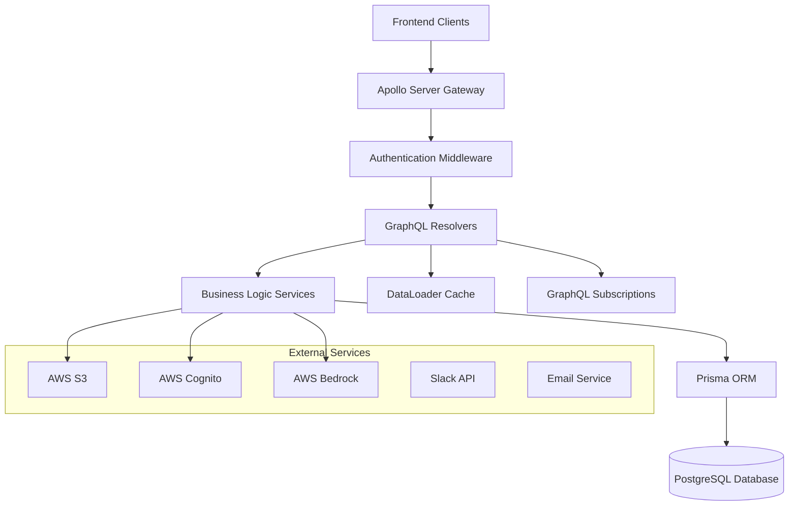

# Design Document

## Overview

The GraphQL Backend API for BidOps.ai will be implemented as a modern, type-safe Node.js application using TypeScript, Apollo Server 4, and Prisma ORM. The architecture follows Domain-Driven Design principles with clear separation of concerns, comprehensive testing, and robust error handling. The API will serve as the central data layer for the entire platform, providing secure, efficient access to all application data.

## Architecture

### High-Level Architecture



### Technology Stack

- **Runtime**: Node.js 20+ with TypeScript 5+
- **GraphQL Server**: Apollo Server 4 with Express integration
- **Database**: PostgreSQL 15+ (RDS for production, Docker for local)
- **ORM**: Prisma 5+ with TypeScript generation
- **Authentication**: AWS Cognito JWT validation
- **Testing**: Jest with supertest for integration testing
- **Validation**: Zod for input validation
- **Caching**: DataLoader for query optimization
- **Real-time**: GraphQL subscriptions with in-memory pub/sub

## Components and Interfaces

### 1. Server Setup and Configuration

**Apollo Server Configuration**
```typescript
interface ServerConfig {
  typeDefs: DocumentNode;
  resolvers: Resolvers;
  context: ContextFunction;
  plugins: ApolloServerPlugin[];
  introspection: boolean;
  playground: boolean;
}
```

**Context Interface**
```typescript
interface GraphQLContext {
  user?: AuthenticatedUser;
  prisma: PrismaClient;
  dataSources: DataSources;
  pubsub: PubSub;
  req: Request;
  res: Response;
}
```

### 2. Authentication and Authorization

**Note**: Authentication is handled by the frontend using AWS Cognito. The backend validates JWT tokens sent from the frontend and extracts user context for authorization.

**JWT Token Validation**
```typescript
interface CognitoJWTPayload {
  sub: string;
  email: string;
  'cognito:groups': string[];
  'cognito:username': string;
  exp: number;
  iat: number;
}

interface AuthenticatedUser {
  id: string;
  email: string;
  roles: UserRole[];
  cognitoUserId: string;
}
```

**Permission System**
```typescript
enum Permission {
  PROJECT_READ = 'project:read',
  PROJECT_WRITE = 'project:write',
  PROJECT_DELETE = 'project:delete',
  KB_GLOBAL_READ = 'kb:global:read',
  KB_GLOBAL_WRITE = 'kb:global:write',
  USER_MANAGE = 'user:manage',
  ADMIN_ALL = 'admin:all'
}

interface PermissionChecker {
  hasPermission(user: AuthenticatedUser, permission: Permission): boolean;
  canAccessProject(user: AuthenticatedUser, projectId: string): boolean;
  canAccessKnowledgeBase(user: AuthenticatedUser, kbId: string): boolean;
}
```

### 3. Resolver Architecture

**Base Resolver Pattern**
```typescript
abstract class BaseResolver {
  protected prisma: PrismaClient;
  protected context: GraphQLContext;
  
  constructor(context: GraphQLContext) {
    this.prisma = context.prisma;
    this.context = context;
  }
  
  protected requireAuth(): AuthenticatedUser {
    if (!this.context.user) {
      throw new ForbiddenError('Authentication required');
    }
    return this.context.user;
  }
  
  protected requirePermission(permission: Permission): void {
    const user = this.requireAuth();
    if (!this.hasPermission(user, permission)) {
      throw new ForbiddenError('Insufficient permissions');
    }
  }
}
```

**Resolver Structure**
- **Query Resolvers**: Read operations with filtering, pagination, and authorization
- **Mutation Resolvers**: Write operations with validation and business logic
- **Subscription Resolvers**: Real-time updates with authentication
- **Field Resolvers**: Complex field resolution with DataLoader optimization

### 4. Data Access Layer

**Prisma Service Pattern**
```typescript
interface PrismaService<T> {
  findMany(args: FindManyArgs): Promise<T[]>;
  findUnique(args: FindUniqueArgs): Promise<T | null>;
  create(args: CreateArgs): Promise<T>;
  update(args: UpdateArgs): Promise<T>;
  delete(args: DeleteArgs): Promise<T>;
}

class ProjectService extends PrismaService<Project> {
  async findByUser(userId: string, filters?: ProjectFilters): Promise<Project[]>;
  async createWithMembers(data: CreateProjectInput, userId: string): Promise<Project>;
  async updateStatus(id: string, status: ProjectStatus, userId: string): Promise<Project>;
}
```

**DataLoader Implementation**
```typescript
interface DataLoaders {
  userLoader: DataLoader<string, User>;
  projectLoader: DataLoader<string, Project>;
  knowledgeBaseLoader: DataLoader<string, KnowledgeBase>;
  artifactLoader: DataLoader<string, Artifact>;
  workflowExecutionLoader: DataLoader<string, WorkflowExecution>;
}
```

### 5. Business Logic Services

**Service Layer Architecture**
```typescript
interface ProjectBusinessLogic {
  createProject(input: CreateProjectInput, userId: string): Promise<Project>;
  updateProjectStatus(projectId: string, status: ProjectStatus, userId: string): Promise<Project>;
  addProjectMember(projectId: string, userId: string, addedBy: string): Promise<ProjectMember>;
  generatePresignedUrls(projectId: string, files: FileRequest[]): Promise<PresignedUrl[]>;
}

interface WorkflowBusinessLogic {
  initializeWorkflow(projectId: string, userId: string): Promise<WorkflowExecution>;
  updateAgentTaskStatus(taskId: string, status: AgentTaskStatus, data?: any): Promise<AgentTask>;
  completeWorkflow(workflowId: string, userId: string): Promise<WorkflowExecution>;
}
```

### 6. External Service Integration

**AWS Service Clients**
```typescript
interface AWSServices {
  s3: S3Client;
  cognito: CognitoIdentityProviderClient;
  bedrock: BedrockClient;
}

interface S3Service {
  generatePresignedUrl(bucket: string, key: string, operation: 'getObject' | 'putObject'): Promise<string>;
  uploadFile(bucket: string, key: string, body: Buffer): Promise<void>;
}

interface CognitoService {
  validateJWT(token: string): Promise<CognitoJWTPayload>;
  // Note: User creation/updates are handled by frontend via Cognito SDK
  // Backend only validates tokens and syncs user data to local database
}
```

## Data Models

### Database Schema (Prisma)

The database schema will be defined using Prisma schema language, implementing all entities from the provided ERD:

**Core Entities**
- User, Role, Permission, UserRole
- Project, ProjectDocument, ProjectMember
- KnowledgeBase, KnowledgeBaseDocument, KnowledgeBasePermission
- Artifact, ArtifactVersion
- WorkflowExecution, AgentTask
- Notification, AuditLog, Integration

**Key Relationships**
- User ↔ Project (many-to-many through ProjectMember)
- Project ↔ KnowledgeBase (many-to-many)
- Project → Artifact (one-to-many)
- Artifact → ArtifactVersion (one-to-many)
- WorkflowExecution → AgentTask (one-to-many)

### GraphQL Schema Types

The GraphQL schema will implement all types, queries, mutations, and subscriptions as defined in the provided schema specification, with proper TypeScript code generation.

## Error Handling

### Error Classification

```typescript
enum ErrorCode {
  AUTHENTICATION_REQUIRED = 'AUTHENTICATION_REQUIRED',
  FORBIDDEN = 'FORBIDDEN',
  NOT_FOUND = 'NOT_FOUND',
  VALIDATION_ERROR = 'VALIDATION_ERROR',
  BUSINESS_LOGIC_ERROR = 'BUSINESS_LOGIC_ERROR',
  EXTERNAL_SERVICE_ERROR = 'EXTERNAL_SERVICE_ERROR',
  DATABASE_ERROR = 'DATABASE_ERROR'
}

class AppError extends Error {
  constructor(
    public code: ErrorCode,
    message: string,
    public statusCode: number = 500,
    public details?: any
  ) {
    super(message);
  }
}
```

### Error Handling Strategy

1. **Input Validation**: Zod schemas for all inputs with detailed error messages
2. **Authentication Errors**: Clear messaging for token validation failures
3. **Authorization Errors**: Specific permission-based error responses
4. **Business Logic Errors**: Domain-specific error handling with context
5. **External Service Errors**: Graceful degradation with retry mechanisms
6. **Database Errors**: Connection handling and transaction rollbacks

### Logging and Monitoring

```typescript
interface Logger {
  info(message: string, meta?: any): void;
  warn(message: string, meta?: any): void;
  error(message: string, error?: Error, meta?: any): void;
  debug(message: string, meta?: any): void;
}

interface Metrics {
  incrementCounter(name: string, tags?: Record<string, string>): void;
  recordHistogram(name: string, value: number, tags?: Record<string, string>): void;
  recordGauge(name: string, value: number, tags?: Record<string, string>): void;
}
```

## Testing Strategy

### Test-Driven Development Approach

1. **Unit Tests**: Individual resolver, service, and utility function testing
2. **Integration Tests**: End-to-end GraphQL operation testing
3. **Database Tests**: Prisma model and migration testing
4. **Authentication Tests**: JWT validation and permission checking
5. **External Service Tests**: Mocked AWS service interactions

### Testing Tools and Patterns

```typescript
interface TestSetup {
  testDatabase: PrismaClient;
  testServer: ApolloServer;
  authToken: string;
  mockServices: MockedServices;
}

interface MockedServices {
  s3Service: jest.Mocked<S3Service>;
  cognitoService: jest.Mocked<CognitoService>;
  bedrockService: jest.Mocked<BedrockService>;
}
```

### Test Categories

**Unit Tests (Jest)**
- Resolver logic testing
- Service layer business logic
- Utility function validation
- Error handling scenarios

**Integration Tests (Supertest + Jest)**
- Complete GraphQL operations
- Authentication flows
- Database transactions
- Subscription functionality

**Database Tests**
- Migration testing
- Seed data validation
- Constraint enforcement
- Performance benchmarks

## Performance Optimization

### Query Optimization

1. **DataLoader Pattern**: Batch and cache database queries
2. **Query Complexity Analysis**: Prevent expensive operations
3. **Pagination**: Cursor-based pagination for large datasets
4. **Field-Level Caching**: Cache expensive computed fields
5. **Database Indexing**: Optimize query performance

### Caching Strategy

```typescript
interface CacheConfig {
  ttl: {
    user: number;
    project: number;
    knowledgeBase: number;
    artifact: number;
  };
}

// Using DataLoader for request-scoped caching
interface DataLoaderCache {
  clear(): void;
  clearAll(): void;
  prime(key: string, value: any): void;
}
```

### Subscription Optimization

1. **In-Memory Pub/Sub**: Apollo Server built-in subscription handling
2. **Connection Management**: Efficient WebSocket handling
3. **Subscription Filtering**: User-specific event filtering


## Security Considerations

### Authentication Security

1. **JWT Validation**: Proper token verification with AWS Cognito public keys
2. **Token Extraction**: Extract user context from validated JWT tokens
3. **User Synchronization**: Sync Cognito user data with local database


### Authorization Security

1. **Role-Based Access Control**: Granular permission system
2. **Resource-Level Security**: Project and KB access control
3. **Data Filtering**: User-context-based data filtering
4. **Audit Logging**: Comprehensive activity tracking

### Input Security

1. **Input Validation**: Zod schema validation for all inputs
2. **SQL Injection Prevention**: Prisma ORM protection
3. **Query Depth Limiting**: Prevent deep query attacks
4. **File Upload Security**: S3 presigned URL validation

## Deployment and Infrastructure

### Environment Configuration

```typescript
interface EnvironmentConfig {
  NODE_ENV: 'development' | 'staging' | 'production';
  PORT: number;
  DATABASE_URL: string;

  AWS_REGION: string;
  COGNITO_USER_POOL_ID: string;
  COGNITO_CLIENT_ID: string;
  S3_BUCKET_NAME: string;
  LOG_LEVEL: 'debug' | 'info' | 'warn' | 'error';
}
```

### Database Migration Strategy

1. **Development**: Automatic migration application
2. **Staging**: Manual migration review and application
3. **Production**: Controlled migration deployment with rollback capability
4. **Backup**: Pre-migration database backups

### Monitoring and Observability

1. **Health Checks**: Database and external service connectivity
2. **Metrics Collection**: Query performance and error rates
3. **Distributed Tracing**: Request flow tracking
4. **Alert Configuration**: Critical error notifications