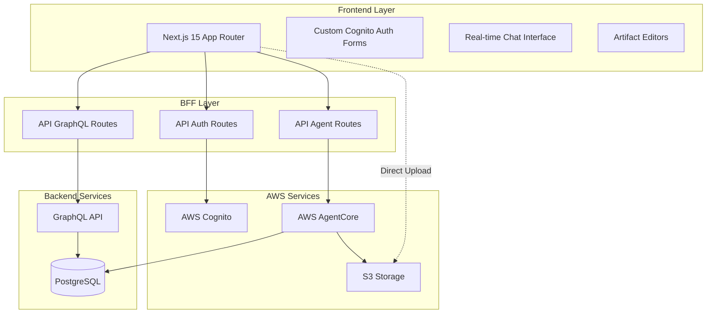
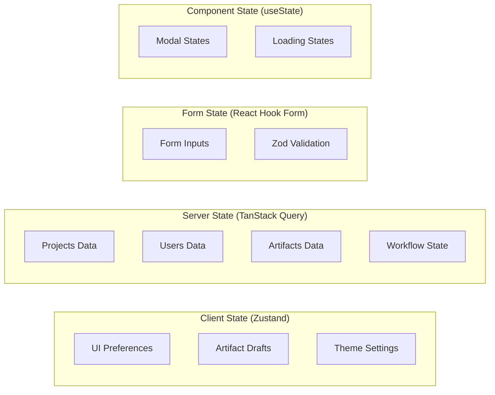
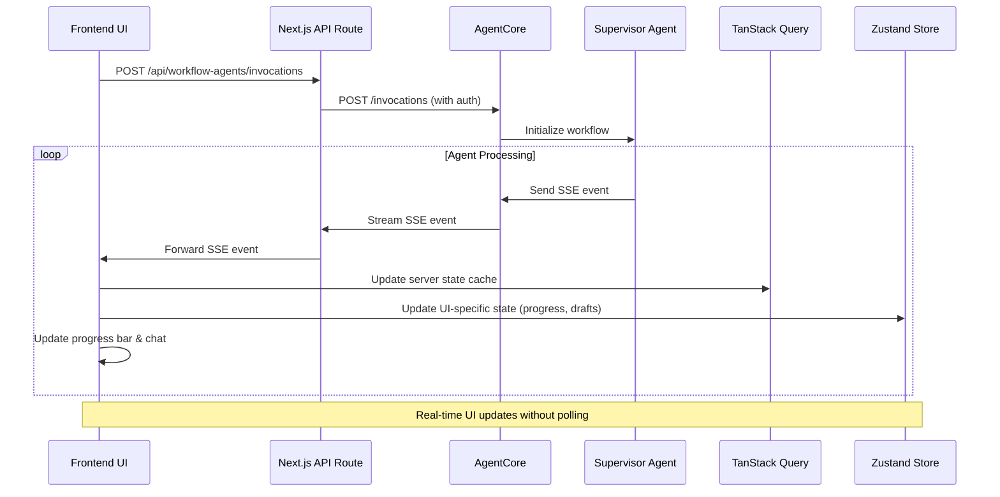

# Design Document

## Overview

This document outlines the technical design for bidops.ai, a cutting-edge AI-powered bid automation platform built with Next.js 15, React 19, and TypeScript. The application features a futuristic interface that combines modern web technologies with AWS services to create an end-to-end bid preparation workflow orchestrated by AI agents.

The system architecture follows a Backend-for-Frontend (BFF) pattern using Next.js API routes to securely handle sensitive operations, while the frontend provides a responsive, real-time interface for users to interact with AI agents through a chat-based workflow.

# High-Level Architecture

# State Management Architecture

# SSE Architecture Overview

The application implements a sophisticated Server-Sent Events (SSE) system to handle real-time communication between the AI agents and the frontend interface. This design ensures users receive immediate feedback during the complex multi-agent workflow.

